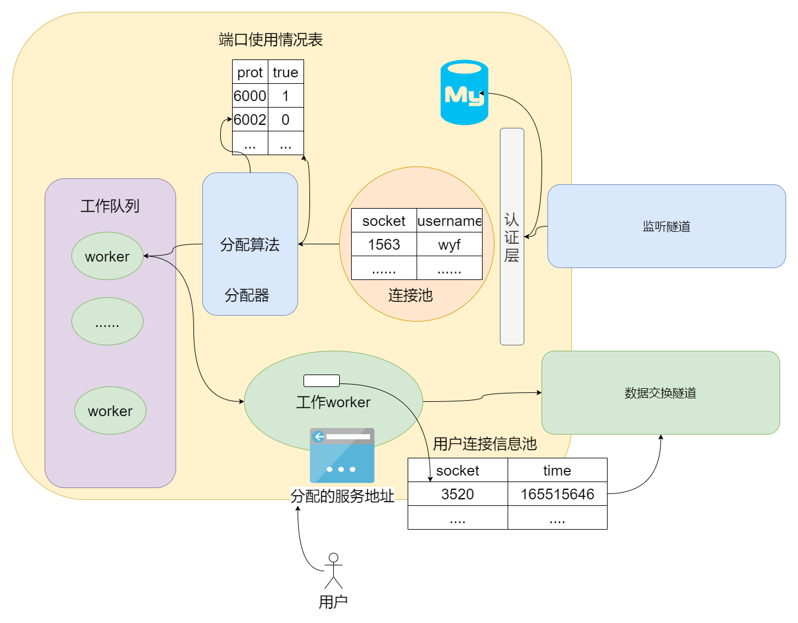

# 内网穿透开发文档

## 1. 引言
这个软件是我在课程设计中完成的一个作业。它的作用是帮助用户在私有网络（比如家里或办公室的网络）中的设备或服务与公共网络（比如互联网）进行通信(前提是你得获得公有服务端的允许)。通常情况下，私有网络中的设备是无法直接从外部访问的，但使用这个软件可以解决这个问题。

我们知道，有时候我们希望能够在外部远程访问家里的摄像头、家庭服务器或办公室的网络摄像头、打印机等设备。而NAT内网穿透软件正是为了解决这样的需求而设计的。

这个软件通过一种特殊的方式，让你能够像访问互联网上的公共设备一样，轻松地访问你私有网络中的设备。它会创建一个安全的连接，将你的请求从公共网络传递到私有网络，然后将响应返回给你。这样，你就可以在任何地方使用互联网连接访问你的设备，而不需要担心防火墙或路由器设置的限制。

这个软件还提供了一些额外的功能，比如可以让你在私有网络中搭建自己的私有云存储，或者在办公室的电脑上远程访问家庭电脑中的文件。它还可以帮助你轻松地进行文件共享或远程协助，无论你身在何处,此外，该软件还可以在局域网中进行使用，这样的话，就屏蔽了具体请求客户端的`IP`,保证了隐私安全。

总之，这个软件旨在让你能够方便地访问你私有网络中的设备或服务，解决内网访问的限制。它是为了提高你的网络使用体验而设计的，并且可以适用于各种常见的私有网络设置。


**注：此软件包含客户端和服务器两部分组成，用户可以根据选择进行使用，假设您有一台公有服务器，你可以将`NAT`的服务器部分部署上去，实现NAT穿透；当然您也可以将服务端部署到本地，实现局域的内网穿透。用户可以根据需要进行选择。**


## 2. 项目概述
### 2.1. 项目背景

在当今数字化时代，互联网的普及和技术的迅速发展使得人们越来越依赖于网络和互联设备。在家庭、办公室或其他场所，私有网络（`LAN`）的使用变得非常普遍。然而，由于网络安全和隐私的考虑，私有网络通常被配置为内部网络，无法直接从外部访问。

这就引发了一个常见的问题：如何在私有网络中的设备和服务与公共网络（比如互联网）之间进行安全、便捷的通信？这个问题尤其突出在需要远程访问家庭摄像头、私有服务器、打印机或其他设备的情况下。

为了解决这个问题，并提供一种简单、高效的解决方案，于是开发了这个NAT内网穿透软件。**该软件旨在克服私有网络中的限制，使用户能够在任何地方通过互联网访问他们的私有网络中的设备和服务。**

### 2.2. 目标

目标：

我们的NAT内网穿透软件的目标是提供一种简单、可靠的解决方案，使用户能够方便地远程访问他们的私有网络中的设备和服务

1. 远程访问：用户可以通过互联网连接，轻松地访问他们私有网络中的设备，如家庭摄像头、私有服务器、打印机等。
2. 私有云搭建：用户可以利用软件搭建自己的私有云存储，方便地存储和共享文件，实现远程访问和协作。
3. 文件共享：用户可以轻松地与他人共享文件和文件夹，无论他们身在何处。
4. 远程协助：软件提供远程协助功能，让用户能够远程协助家庭成员、同事或客户解决问题，提供技术支持或培训。

### 2.3. 关键特性和功能

1. 远程访问：用户可以通过互联网连接远程访问私有网络中的设备和服务，如家庭摄像头、私有服务器、打印机等。
2. 安全通信：软件提供安全的通信通道，使用加密协议保护数据传输的安全性和隐私(目前还没有集成该功能，后续会继续优化)。
3. 简单设置：用户可以通过简单的设置步骤和直观的界面，轻松地配置和启用内网穿透功能。
4. 网络穿透：软件通过网络穿透技术，允许用户在无需手动配置端口映射或路由器设置的情况下，实现对私有网络设备的访问。
5. 多设备支持：软件支持同时访问多个设备，允许用户管理和访问他们私有网络中的多个设备和服务。
6. 高性能和稳定性：软件设计优化，具有良好的性能和稳定性，确保远程访问的可靠性和流畅性。
7. 自定义配置：软件提供灵活的配置选项，允许用户根据他们的需求自定义设置和参数，以满足特定的网络环境和要求。
8. 日志记录和故障排除：软件记录关键事件和活动，以便用户进行故障排除和日志分析，帮助解决问题和提供技术支持。
9. 跨平台兼容：软件设计为跨平台兼容，可在不同的操作系统（如Windows、Mac、Linux等）上运行。

### 2.4. 术语和缩略词

1. **NAT**：网络地址转换（Network Address Translation），一种将私有IP地址转换为公共IP地址的网络技术。
2. **LAN**：局域网（Local Area Network），指在相对较小的范围内，如家庭、办公室或学校等地方连接的计算机网络。
3. **互联网**（Internet）：全球范围内相互连接的计算机网络，通过TCP/IP协议族进行数据传输。
4. **内网穿透**：通过网络隧道或代理等方式，将公共网络上的请求转发到私有网络中的设备或服务。
5. **端口映射**：将公共网络上的端口请求映射到私有网络中的特定设备或服务的过程。
6. **TCP**/IP：传输控制协议/互联网协议（Transmission Control Protocol/Internet Protocol），互联网通信的基本协议。
7. **API**：应用程序编程接口（Application Programming Interface），用于不同软件组件之间的通信和交互的一组定义。
8. **VPN**：虚拟专用网络（Virtual Private Network），通过公共网络建立加密通道，实现远程访问私有网络的安全连接。
9. **NAT**类型：对NAT设备进行分类的标识，如全锥形NAT、限制锥形NAT等，用于描述网络连接的可达性和访问限制。


## 3. 架构概述

### 3.1. 系统架构

整体的系统架构为`客户端-服务器模式`，整体的视图如下所示：


整体的系统视图如上面所示，用户会根据公网服务地址访问到位于内网里的服务。当开发者想代理内部的服务时，只需要与服务端建立连接，服务端会根据实时使用情况向客户端分配一个限制空余的端口代理该服务；用户根据这个端口访问开发者所开发的内网服务。服务端和客户端详细的架构在下方展示。

### 3.2. 服务端架构



服务端的处理流程大致是这样的：

服务端启动一个控制接口，用于传递控制信息（类似于`ftp`协议），该控制接口有两个作用，**监听客户端发送的连接请求**和**传递控制信息**；当监听到用户发送过来的请求时，会从`TCP stream`流中先提取出用户信息(`username`，`password`),紧接着，服务端会根据用户信息进行校验，校验的内容包括用户是否注册以及用户账户是否过期;如果用户没有通过校验，则向客户端发送`AUTH_FAIL`类型的信号，表示认证失败；如果通过了校验，则会将用户的信息`pull`入到连接池中去，至此，`控制端`的功能到此为止，紧接着就是整个服务端的核心内容了；

**分配器**会实时的检测整个服务端的资源的情况，如果服务端有充足的资源够客户端使用时，分配器会给该客户端分配一个代理`port`，并在全局记录下分配信息；与此同时开辟一个`goroutine`(协程)去处理该连接请求。

**worker**就是实际处理真实业务的线程，该`worker`里面存储着本次连接的所有信息如：`ID(客户端ID)`、`ClientConn(客户端连接socket)`、`ServerListener(服务端代理socket)`、`Port`、`UserConnPool(用户连接池)`、`CurrentTransmitBytes(转发字节数)`、`single(信号)`;**worker**会根据`userPool`里面的连接信息，通过`数据交换隧道`实现代理的功能。


### 3.3. 客户端架构


客户端的流程就十分的简单了：

首先会将自己的基本信息封装好(`username`,`password`)；向服务端发送建立连接的请求，这时如果没有收到`AUTH_FAIL`这个信号，那么代表着认证成功了，这时程序会一直阻塞到这里直到收到服务端发来的信号`USER_INFORMATION`这代表着服务端已经准备好了这次会话所有的资源了，可以进行连接了。这时客户端就正确的启动了。

客户端的流程如下图所示：


### 3.4. 外部依赖关系

本项目依赖数据库来保存用户信息和实现鉴权功能。我们选择使用MYSQL 8.0版本作为存储解决方案。

## 4. 安装和配置

### 4.1. 安装教程

您可以通过项目的[github](https://github.com/byteYuFan/NAT)地址去下载最新版本的代码，并编译他。或者您也可以直接找`release`进行下载使用。

地址附带如下：

`github`：https://github.com/byteYuFan/NAT

`release`：https://github.com/byteYuFan/NAT/releases


或者您也可以通过访问我们的官网进行下载使用：

官网地址`pogf.com.cn:8000`,你可以根据自己需要的版本进行下载使用


### 4.2. 数据库配置

您需要将这两张表转存到您的数据库中去，这样您就可以正常的使用认证功能了。

```mysql
CREATE TABLE `userInfo_userinfo` (
  `user_id` int NOT NULL AUTO_INCREMENT,
  `username` varchar(255) NOT NULL,
  `password` varchar(255) NOT NULL,
  `email` varchar(254) DEFAULT '00000000@test.com',
  `flag` tinyint(1) NOT NULL DEFAULT '0',
  `time` datetime(6) DEFAULT NULL ON UPDATE CURRENT_TIMESTAMP(6),
  PRIMARY KEY (`user_id`)
) ENGINE=InnoDB DEFAULT CHARSET=utf8mb4 COLLATE=utf8mb4_0900_ai_ci;
```

```mysql
CREATE TABLE `bars` (
  `id` bigint NOT NULL AUTO_INCREMENT,
  `bar` bigint NOT NULL,
  `username` varchar(255) NOT NULL,
  PRIMARY KEY (`id`)
) ENGINE=InnoDB DEFAULT CHARSET=utf8mb4 COLLATE=utf8mb4_0900_ai_ci;
```

## 5. 使用说明

### 5.1. 操作说明

#### 1. 服务端

根据自己的需求将服务端上传到指定的为止，这里我使用的是腾讯云服务器，在`root`的模式下，给其增加执行权限并查看其详细的信息:

```shell
[root@VM-4-7-centos ~]# chmod a+x server
[root@VM-4-7-centos ~]# ll server
-rwxr-xr-x 1 root root 13379532 Jul 16 17:33 server
```

配置脚本：

本项目采用`yaml`文件的配置方式,如下所示：

```yaml
Server:
  Name: "Server-NAT"
  ControllerAddr: "0.0.0.0:8080"
  TunnelAddr: "0.0.0.0:8008"
  VisitPort:
    - 60000
    - 60001
    - 60002
    - 60003
  TaskQueueNum: 4
  TaskQueueBuff: 32
  MaxTCPConnNum: 4
  MaxConnNum: 256
  LogFilename: "server.log"
  StartAuth: true
  StartLog: true
Database:
  Username: "root"
  Password: "123456"
  Host: "0.0.0.0:3309"
  DBName: "nat"

```

这个配置文件包含了服务器（Server）和数据库（Database）的相关配置信息。下面是每个配置项的含义：

Server配置：

- `Name`: 服务器的名称，此处设置为 "Server-NAT"。
- `ControllerAddr`: 控制器的地址，用于与客户端进行通信，此处设置为 "0.0.0.0:8080"，表示监听所有可用的网络接口和端口8080。
- `TunnelAdd`r: 隧道地址，用于与其他服务器或设备建立隧道连接，此处设置为 "0.0.0.0:8008"。
- `VisitPort`可访问的端口列表，这里列出了一组端口号 [60000, 60001, 60002, 60003]，表示允许访问这些端口的连接。
- `TaskQueueNum`: 任务队列数量，指定用于处理请求的任务队列的数量，此处设置为 4。
- `TaskQueueBuff`: 任务队列缓冲大小，用于缓存待处理请求的数量，此处设置为 32。
- `MaxTCPConnNum`: 最大TCP连接数，限制允许的最大TCP连接数量，此处设置为 4。
- `MaxConnNum`: 最大连接数，限制允许的最大连接数量，此处设置为 256。
- `LogFilename`: 日志文件名，指定日志输出的文件名，此处设置为 "server.log"。
- `StartAuth`: 是否启用身份验证，设置为 true 表示启用身份验证功能。
- `StartLog`: 是否启用日志记录，设置为 true 表示启用日志记录功能。

Database配置：

- `Username`: 数据库用户名，设置为 "root"。
- `Password`: 数据库密码，设置为 "123456"。
- `Host`: 数据库主机地址，设置为 "0.0.0.0:3309"。
- `DBName`: 数据库名称，设置为 "nat"。

根据自己本地的需求之后配置好`serber.yml`问价之后，就可以启动程序了：

```shell
[root@VM-4-7-centos ~]# ./server
  _   _              _______    _____   ______   _____   __      __  ______   _____
 | \ | |     /\     |__   __|  / ____| |  ____| |  __ \  \ \    / / |  ____| |  __ \
 |  \| |    /  \       | |    | (___   | |__    | |__) |  \ \  / /  | |__    | |__) |
 | . ` |   / /\ \      | |     \___ \  |  __|   |  _  /    \ \/ /   |  __|   |  _  /
 | |\  |  / ____ \     | |     ____) | | |____  | | \ \     \  /    | |____  | | \ \
 |_| \_| /_/    \_\    |_|    |_____/  |______| |_|  \_\     \/     |______| |_|  \_\


[ServerName] Server-NAT
[MaxServerConn] 4
[服务端开启端口] [60000 60001 60002 60003]
[ListenTaskQueue] 正在监听工作队列传来的信息……
[服务器控制端开始监听]0.0.0.0:8080
[Start Auth Successfully!] 服务器开启认证请求

```

#### 2. 客户端

这里我选择将客户端下载到本地`Windows`电脑上进行测试，已经下载成功，现在进行相关配置：

```yaml
Auth:
  Username: "3210561027"
  Password: "00000000"
Client:
  Name: Client-NAT
  PublicServerAddr: pogf.com.cn
  TunnelServerAddr: pogf.com.cn:8008
  ControllerAddr: pogf.com.cn:8080
  LocalServerAddr: 0.0.0.0:8080
```

这个配置文件包含了身份验证（Auth）和客户端（Client）的相关配置信息。下面是每个配置项的含义：

Auth配置：

- `Username`: 用户名，设置为 "3210561027"。
- `Password`: 密码，设置为 "00000000"。

Client配置：

- `Name`: 客户端的名称，此处设置为 "Client-NAT"。
- `PublicServerAddr`: 公共服务器地址，表示代理服务器的地址。
- TunnelServerAddr: 隧道服务器地址。
- ControllerAddr: 控制器地址，用于与服务器进行通信。
- LocalServerAddr: 本地服务器地址，用于提供本地服务，设置为 0.0.0.0:8000，表示监听所有可用的网络接口和端口8080。

这些配置项定义了身份验证和客户端的各种参数和选项，确保客户端能够按照指定的设置与服务器进行通信和访问服务。请注意，根据你的实际需求，你可能需要根据具体情况进行调整和修改配置文件中的值。

### 5.2. 内网穿透功能代理内部服务

测试说明：

在本地启动一个`8080`端口的服务，通过内网穿透软件代理该服务，分别使用`curl`，`浏览器`,`安卓手机`进行测试，看是否可以访问到该服务。

```go
package main

import (
	"github.com/gin-gonic/gin"
	"log"
)

func main() {
	// 创建一个Gin的默认引擎
	r := gin.Default()

	// 定义一个路由处理函数
	r.GET("/", func(c *gin.Context) {
		c.JSON(200, gin.H{
			"message": "Hello, World!",
		})
	})

	// 启动Web服务，监听在8080端口
	err := r.Run(":8080")
	if err != nil {
		log.Fatal("启动Web服务失败: ", err)
	}
}
```

这段代码的作用是创建一个简单的Web服务，并定义了一个根路由处理函数，返回一个包含"Hello, World!"的JSON响应。

现在我们使用内网穿透软件代理其功能：

```shell
$ ./client.exe 
  _   _              _______    _____   _        _____   ______   _   _   _______ 
 | \ | |     /\     |__   __|  / ____| | |      |_   _| |  ____| | \ | | |__   __|
 |  \| |    /  \       | |    | |      | |        | |   | |__    |  \| |    | |
 | . ` |   / /\ \      | |    | |      | |        | |   |  __|   | . ` |    | |
 | |\  |  / ____ \     | |    | |____  | |____   _| |_  | |____  | |\  |    | |
 |_| \_| /_/    \_\    |_|     \_____| |______| |_____| |______| |_| \_|    |_|


[Client Running Successfully!]
[PublicAddress] pogf.com.cn
[TunnelAddress] pogf.com.cn:8008
[LocalAddress] 127.0.0.1:8080
[Conn Successfully]pogf.com.cn:8080
[auth] 发送认证消息成功。
[接收到USER_INFORMATION]
[ClientInfoUID] 1
[VisitAddress] pogf.com.cn:60002


```

我们使用curl工具去测试`pogf.com.cn:60002`:

```shell
C:\Users\wangyufan>curl pogf.com.cn:60002
{"message":"Hello, World!"}
```

发现没有任何问题，我们通过`谷歌浏览器无痕窗口访问它`:


也没有任何问题，我们使用手机端进行访问：


完全正确。

### 5.3. 测试代理`Redis`服务

测试说明：

在本地启动`Redis`服务，通过内网穿透软件进行代理，通过服务端的地址向redis插入一条数据，然后在本地进行查看，如果在本地看到了这条消息，则说明代理成功：

初始`redis`情况

```shell
127.0.0.1:6379> keys *
(empty list or set)
127.0.0.1:6379>
```

更改客户端配置并启动客户端:

```yaml
LocalServerAddr: "127.0.0.1:6379"
```

```shell

[Client Running Successfully!]
[PublicAddress] pogf.com.cn
[TunnelAddress] pogf.com.cn:8008
[LocalAddress] 127.0.0.1:6379
[Conn Successfully]pogf.com.cn:8080
[auth] 发送认证消息成功。
[接收到USER_INFORMATION]
[ClientInfoUID] 1
[VisitAddress] pogf.com.cn:60000

```

通过`redis`客户端工具连接`pogf.com.cn:60000`这个地址，并向里面插入一条数据：


成功插入，现在我们在本地查看刚刚插入的这条数据：

```shell
127.0.0.1:6379> keys *
1) "test"
127.0.0.1:6379> get test
"this is a test about NAT."
```

完全正确。

### 5.4. 局域网内屏蔽实际地址

通过上述的例子，我们不难明白，在局域网中，我们可以通过一台主机作为服务器，使用该主机的`IP`作为我们服务的访问地址，可以屏蔽我们服务的实际地址。

## 6. 开发核心

以下内容将是整个系统的核心开发过程。主要分为**协议概述**、**服务器**、**客户端**这三个部分组成，我们也从这三个角度进行介绍`NAT`项目。

### 6.1. 协议概述

我们知道，`TCP`传输数据的特定是`字节流`的，因此，当我们发送一些信息时，有可能这些包会被黏在一起，客户端收到了不该出现的信息，这是我们万万不希望出现的，因此我们在这块定义相关的发包和收包的协议以避免发生这些问题。

黏包问题通常是由应用层协议设计不合理造成的，而不是TCP协议本身引起的。

在应用层协议中，黏包问题可能出现的原因包括：

1. **消息边界模糊**：应用层协议没有明确定义消息的边界，导致接收方无法准确切分和解析消息。
2. **数据的粘连**：发送方连续发送多个消息，但这些消息在传输过程中被合并为一个或部分粘连在一起，导致接收方无法正确判断消息的边界。
3. **消息长度不固定**：应用层协议中的消息长度不固定，导致发送方和接收方在切分和解析消息时出现不一致。
4. **处理延迟**：接收方在处理接收到的消息时存在延迟，而发送方持续发送消息，导致已接收和待接收的消息粘连在一起。

为了解决应用层协议的黏包问题，可以采取以下一些常见的解决方案：

1. **消息长度字段**：在应用层协议中，引入消息长度字段，使接收方能够根据长度字段准确切分消息。
2. **消息分隔符**：定义特定的消息分隔符，在消息中插入分隔符以标识消息的边界。
3. **消息头标识**：在消息头中添加特定的标识符，用于标识消息的开始和结束。
4. **消息序号**：在每个消息中添加序号，接收方可以根据序号判断消息的完整性。
5. **应用层缓冲区**：接收方使用应用层缓冲区，将接收到的数据存储起来，然后根据应用层协议的定义进行消息的切分和处理。

#### 1. 消息接口定义

```go
// IMessage 将请求的消息封装到一个Message中，定义抽象的接口
type IMessage interface {
	//	GetMsgID 获取消息的ID
	GetMsgID() uint32
	// GetMsgDataLen 获取消息长度
	GetMsgDataLen() uint32
	// GetMsgData 获取消息内容
	GetMsgData() []byte
	//	SetMsgID 设置消息的ID
	SetMsgID(uint32)
	// SetMsgLen 设置消息长度
	SetMsgLen(uint32)
	// SetMsgData 设置消息内容
	SetMsgData([]byte)
}
```

该接口`IMessage`定义了封装请求消息到`Message`的方法，并提供了一些抽象的操作消息的方法。以下是对该接口的描述：

- `GetMsgID() uint32`：获取消息的ID，返回一个`uint32`类型的消息ID。
- `GetMsgDataLen() uint32`：获取消息的长度，返回一个`uint32`类型的消息长度。
- `GetMsgData() []byte`：获取消息的内容，返回一个`[]byte`类型的消息内容。
- `SetMsgID(uint32)`：设置消息的ID，接受一个`uint32`类型的参数，用于设置消息的ID。
- `SetMsgLen(uint32)`：设置消息的长度，接受一个`uint32`类型的参数，用于设置消息的长度。
- `SetMsgData([]byte)`：设置消息的内容，接受一个`[]byte`类型的参数，用于设置消息的内容。

#### 2. 消息接口实现

```go
// Message 该结构体为消息类型，其中包括消息的ID编号，
// 消息的长度 消息的内容
// 其中 ID 和 DataLen 为固定长度大小 为 4 + 4 = 8 字节
// Data 为消息的具体内容 其中DataLen为Data的大小
type Message struct {
	// ID 消息ID
	ID uint32
	// DataLen 消息长度
	DataLen uint32
	// Data 消息的内容
	Data []byte
}
// NewMsgPackage 新建一个Message消息的包 传入的参数为消息的type-id 消息的实际内容
func NewMsgPackage(id uint32, data []byte) *Message {
	return &Message{
		ID:      id,
		DataLen: uint32(len(data)),
		Data:    data,
	}
}

// GetMsgID 获取消息的ID
func (m *Message) GetMsgID() uint32 {
	return m.ID
}

// GetMsgDataLen 获取消息长度
func (m *Message) GetMsgDataLen() uint32 {
	return m.DataLen
}

// GetMsgData 获取消息内容
func (m *Message) GetMsgData() []byte {
	return m.Data
}

// SetMsgID 设置消息的ID
func (m *Message) SetMsgID(id uint32) {
	m.ID = id
}

// SetMsgLen 设置消息长度
func (m *Message) SetMsgLen(len uint32) {
	m.DataLen = len
}

// SetMsgData 设置消息内容
func (m *Message) SetMsgData(data []byte) {
	m.Data = data
}
```

- `ID uint32`：消息的ID编号，占据固定长度的4字节。
- `DataLen uint32`：消息的长度，占据固定长度的4字节。
- `Data []byte`：消息的具体内容，长度由`DataLen`指定。

此外，代码还提供了一些方法来操作`Message`结构体：

- `NewMsgPackage(id uint32, data []byte) *Message`：创建一个新的`Message`消息对象，传入消息的ID和实际内容作为参数。
- `GetMsgID() uint32`：获取消息的ID。
- `GetMsgDataLen() uint32`：获取消息的长度。
- `GetMsgData() []byte`：获取消息的内容。
- `SetMsgID(id uint32)`：设置消息的ID。
- `SetMsgLen(len uint32)`：设置消息的长度。
- `SetMsgData(data []byte)`：设置消息的内容。

#### 3. 传递消息接口

```go
// IDataPack 抽象层封装包解决TCP黏包问题的拆包封装包的模块
// 针对Message进行TLV格式的封装
// 针对Message进行TLV格式的拆包
// 先读取固定长度的head-->消息的长度和消息的类型
// 在根据消息内容的长度，在读取内容
// 直接面向TCP连接的数据流 TCP stream
type IDataPack interface {
	// GetHeadLen 获取包的头长度
	GetHeadLen() uint32
	// Pack 封包
	Pack(msg IMessage) ([]byte, error)
	// Unpack 拆包
	Unpack([]byte) (IMessage, error)
}
```

上述代码定义了一个名为`IDataPack`的接口，用于抽象层封装包解决TCP黏包问题的拆包封装包的模块。该接口提供以下方法：

- `GetHeadLen() uint32`：获取包的头长度。用于确定消息头部的固定长度。
- `Pack(msg IMessage) ([]byte, error)`：封包方法，将消息进行封装成字节流的形式，用于发送。
- `Unpack([]byte) (IMessage, error)`：拆包方法，将接收到的字节流进行解析，还原成消息对象。

接口的实现类针对`Message`消息进行了TLV格式的封装和拆包操作。TLV格式指的是消息头部包含类型（Type）、长度（Length），再加上实际的消息内容（Value）。

具体的封包过程如下：

1. 根据消息对象的内容，构建消息头部，包含消息的长度和类型信息。
2. 将消息头部和消息内容按照一定的规则拼接在一起，形成完整的封包数据。

具体的拆包过程如下：

1. 先读取固定长度的头部数据，获取消息的长度和类型信息。
2. 根据消息长度信息，读取对应长度的消息内容。
3. 根据读取到的头部和内容，还原成完整的消息对象。

通过实现`IDataPack`接口的具体类，可以对TCP连接中的数据流进行封包和拆包操作，解决TCP黏包问题，确保消息的完整传输。

#### 4. 传递消息实体

```go
// DataPackage 封包解包的结构体
type DataPackage struct {
}

// NewDataPackage 创建一个封包拆包的实例
func NewDataPackage() *DataPackage {
	return &DataPackage{}
}

// GetHeadLen 获取包头的长度 根据我们的协议定义直接返回8就可以了
func (dp *DataPackage) GetHeadLen() uint32 {
	return uint32(8)
}

// Pack 将 ninterfance.IMessage 类型的结构封装为字节流的形式
// 字节流形式 [ 数据长度 + ID + 真实数据 ]
func (dp *DataPackage) Pack(msg ninterfance.IMessage) ([]byte, error) {
	// 创建一个字节流的缓存，将msg的信息一步一步的填充到里面去
	dataBuff := bytes.NewBuffer([]byte{})
	if err := binary.Write(dataBuff, binary.LittleEndian, msg.GetMsgDataLen()); err != nil {
		return nil, err
	}
	if err := binary.Write(dataBuff, binary.LittleEndian, msg.GetMsgID()); err != nil {
		return nil, err
	}
	if err := binary.Write(dataBuff, binary.LittleEndian, msg.GetMsgData()); err != nil {
		return nil, err
	}
	return dataBuff.Bytes(), nil
}

func (dp *DataPackage) Unpack(data []byte) (ninterfance.IMessage, error) {
	// 创建一个从data里面读取的ioReader
	dataBuffer := bytes.NewBuffer(data)
	msg := &Message{}
	if err := binary.Read(dataBuffer, binary.LittleEndian, &msg.DataLen); err != nil {
		return nil, err
	}
	if err := binary.Read(dataBuffer, binary.LittleEndian, &msg.ID); err != nil {
		return nil, err
	}
	return msg, nil
}

```

这段代码实现了一个数据包的封包（Pack）和拆包（Unpack）的功能，用于将消息（Message）封装为字节流形式，并将字节流解析还原为消息对象。

1. `DataPackage` 结构体是封包和拆包的实现结构体，其中没有存储任何状态信息。
2. `NewDataPackage()` 函数用于创建一个 `DataPackage` 实例，返回指针。
3. `GetHeadLen()` 方法用于获取包头的长度，这里直接返回固定值 8，表示包头长度为 8 字节。
4. `Pack(msg ninterfance.IMessage) ([]byte, error)` 方法将传入的 `IMessage` 对象封装为字节流形式。具体实现如下：
   1. 创建一个字节流缓存 `dataBuff`。
   2. 使用 `binary.Write` 方法按照大端字节序将消息的数据长度、ID和真实数据依次写入 `dataBuff`。
   3. 最后，返回 `dataBuff.Bytes()`，即封装好的字节流。
5. `Unpack(data []byte) (ninterfance.IMessage, error)` 方法用于将字节流解析为消息对象。具体实现如下：
   1. 创建一个从 `data` 中读取的 `dataBuffer`。
   2. 创建一个空的 `Message` 对象 `msg`。
   3. 使用 `binary.Read` 方法按照大端字节序从 `dataBuffer` 读取数据长度和ID，并将其赋值给 `msg` 的对应字段。
   4. 最后，返回解析得到的 `msg` 对象。

#### 5. 协议约束

```go
const (
	USER_AUTHENTICATION_SUCCESSFULLY = 10001
)
const (
	NEW_CONNECTION     = 20001
	USER_INFORMATION   = 20002
	KEEP_ALIVE         = 20003
	CONNECTION_IF_FULL = 20004
)

const (
	USER_NOT_EXIST     = 30001
	USER_ALREADY_EXIST = 30002
	USER_EXPIRED       = 30003
	PASSWORD_INCORRET  = 30004
	AUTH_FAIL          = 30005
)

const (
	USER_REQUEST_AUTH = 60001
)
```

1. 在第一个常量块中，`USER_AUTHENTICATION_SUCCESSFULLY` 的值为 10001，表示用户身份验证成功。
2. 在第二个常量块中，定义了以下常量：
   - `NEW_CONNECTION`：值为 20001，表示新的连接。
   - `USER_INFORMATION`：值为 20002，表示用户信息。
   - `KEEP_ALIVE`：值为 20003，表示保持连接。
   - `CONNECTION_IF_FULL`：值为 20004，表示连接已满。
3. 在第三个常量块中，定义了以下常量：
   - `USER_NOT_EXIST`：值为 30001，表示用户不存在。
   - `USER_ALREADY_EXIST`：值为 30002，表示用户已存在。
   - `USER_EXPIRED`：值为 30003，表示用户已过期。
   - `PASSWORD_INCORRET`：值为 30004，表示密码不正确。
   - `AUTH_FAIL`：值为 30005，表示认证失败。
4. 在第四个常量块中，定义了以下常量：
   - `USER_REQUEST_AUTH`：值为 60001，表示用户请求认证。

在后续的过程中，将会更具系统的设计和相关业务不断进行更新操作。

```go
var ProtocolMap map[uint32]interface{}

func init() {
	ProtocolMap = make(map[uint32]interface{})
	// 添加创建协议
	ProtocolMap[NEW_CONNECTION] = "NEW_CONNECTION"
	ProtocolMap[USER_INFORMATION] = ClientConnInfo{}
	ProtocolMap[KEEP_ALIVE] = "ping"
	ProtocolMap[CONNECTION_IF_FULL] = "the-connection-is-full."

	ProtocolMap[USER_ALREADY_EXIST] = "user already exist!"
	ProtocolMap[USER_NOT_EXIST] = "user not exist."
	ProtocolMap[USER_EXPIRED] = "user not expired."
	ProtocolMap[PASSWORD_INCORRET] = "The password is incorrect."

	ProtocolMap[USER_AUTHENTICATION_SUCCESSFULLY] = "Authentication successful!"
}
```

这段代码定义了一个名为 `ProtocolMap` 的变量，它是一个映射（map）类型，用于存储消息协议的映射关系。

在 `init()` 函数中，首先使用 `make()` 函数创建了一个空的 `ProtocolMap`，然后通过键值对的方式将不同的消息协议与对应的值进行关联。

具体的映射关系如下：

- `NEW_CONNECTION` 对应的值是字符串 `"NEW_CONNECTION"`，表示新连接的协议。
- `USER_INFORMATION` 对应的值是 `ClientConnInfo{}`，表示用户信息的协议，`ClientConnInfo` 是一个结构体类型。
- `KEEP_ALIVE` 对应的值是字符串 `"ping"`，表示保持连接的协议。
- `CONNECTION_IF_FULL` 对应的值是字符串 `"the-connection-is-full."`，表示连接已满的协议。
- `USER_ALREADY_EXIST` 对应的值是字符串 `"user already exist!"`，表示用户已存在。
- `USER_NOT_EXIST` 对应的值是字符串 `"user not exist."`，表示用户不存在。
- `USER_EXPIRED` 对应的值是字符串 `"user not expired."`，表示用户未过期。
- `PASSWORD_INCORRET` 对应的值是字符串 `"The password is incorrect."`，表示密码不正确
- `USER_AUTHENTICATION_SUCCESSFULLY` 对应的值是字符串 `"Authentication successful!"`，表示通过这个 `ProtocolMap`，可以根据特定的协议值获取对应的消息或状态信息，方便在代码中处理不同的协议情况。

### 6.2. 通用配置

#### 1. 交换数据函数

这一步是整个内网穿透的核心过程，不管以后整个程序写的如何，此处都是十分重要的。这一步呢，我们要封装一个交换数据的函数，即就是，将一个`tcpConn`的数据转发到另一个`tcpConn`里面去，在实现这些内容之前，我们先看看`go`提供的一个函数`io.Copy`:

```go
func Copy(dst Writer, src Reader) (written int64, err error) {
	return copyBuffer(dst, src, nil)
}
```

参数说明：

- `dst` 是目标 `io.Writer` 接口，用于接收拷贝的数据。
- `src` 是源 `io.Reader` 接口，用于提供要拷贝的数据。

返回值：

- `written` 是拷贝的字节数。
- `err` 是可能发生的错误。如果拷贝操作成功，该值为 `nil`。

`io.Copy` 函数会不断地从源 `src` 中读取数据，并将其写入目标 `dst`，直到源 `src` 的数据结束或发生错误。它会自动处理数据的缓冲和复制过程，简化了数据拷贝的操作。

看了这个函数我们是不是一下子就明白了，交换数据是如此的`Easy`!

`TCPConn`这个类型实现了`Write(p []byte) (n int, err error)`和`Read(p []byte) (n int, err error)`方法，那么这个类型也就实现了`Writer`和`Reader`接口，因此可以直接调用这个函数。（go 语言特性，我非常喜欢）。

于是就有了我们封装好的函数：

```go
// SwapConnDataEachOther 通讯双方相互交换数据
func SwapConnDataEachOther(local, remote *net.TCPConn) {
	go swapConnData(local, remote)
	go swapConnData(remote, local)
}

// SwapConnData 这个函数是交换两个连接数据的函数
func swapConnData(local, remote *net.TCPConn) {
	// 关闭本地和远程连接通道
	defer local.Close()
	defer remote.Close()
	// 将remote的数据拷贝到local里面
	_, err := io.Copy(local, remote)
	if err != nil {
		return
	}
}
```

#### 2. 创建TCP监听和连接

```go
func CreateTCPListener(addr string) (*net.TCPListener, error) {
	tcpAddr, err := net.ResolveTCPAddr("tcp", addr)
	if err != nil {
		return nil, err
	}
	tcpListener, err := net.ListenTCP("tcp", tcpAddr)
	if err != nil {
		return nil, err
	}
	return tcpListener, nil
}

// CreateTCPConn 连接指定的TCP
func CreateTCPConn(addr string) (*net.TCPConn, error) {
	tcpAddr, err := net.ResolveTCPAddr("tcp", addr)
	if err != nil {
		return nil, err
	}
	tcpConn, err := net.DialTCP("tcp", nil, tcpAddr)
	if err != nil {
		return nil, err
	}
	return tcpConn, nil
}

```

这两个函数比较简单，我就不在赘述了，`CreateTCPListener`是新建一个`tcp`的`listener`,`CreateTCPConn`是新建一个`tcp`的`connecter`，非常的简单。

#### 3. 客户端连接信息模块

此模块是客户端和服务器约定好如何传输用户的数据，如何将用户信息转化为字节流，以及如何从字节流中解封装为用户信息，也可以叫做协议吧。

```go
// ClientConnInfo 客户端连接信息
type ClientConnInfo struct {
	UID  int64
	Port int32
}

// NewClientConnInstance 新建一个实体
func NewClientConnInstance(id int64, port int32) *ClientConnInfo {
	return &ClientConnInfo{
		UID:  id,
		Port: port,
	}
}

// ToBytes 将 ClientConnInfo 结构体转换为字节流
func (info *ClientConnInfo) ToBytes() ([]byte, error) {
	buf := new(bytes.Buffer)

	// 使用 binary.Write 将字段逐个写入字节流
	if err := binary.Write(buf, binary.BigEndian, info.UID); err != nil {
		return nil, err
	}
	if err := binary.Write(buf, binary.BigEndian, info.Port); err != nil {
		return nil, err
	}

	return buf.Bytes(), nil
}

// FromBytes 从字节流中恢复 ClientConnInfo 结构体
func (info *ClientConnInfo) FromBytes(data []byte) error {
	buf := bytes.NewReader(data)
	// 使用 binary.Read 从字节流中读取字段值
	if err := binary.Read(buf, binary.BigEndian, &info.UID); err != nil {
		return err
	}
	if err := binary.Read(buf, binary.BigEndian, &info.Port); err != nil {
		return err
	}
	return nil
}
```

单元测试：

```go
func TestClientConnInfo_FromBytes(t *testing.T) {
	ci := ClientConnInfo{
		UID:  1,
		Port: 8080,
	}
	data, err := ci.ToBytes()
	if err != nil {
		fmt.Println("[ToBytes Err]", err)
	} else {
		fmt.Println("[ToBytes Successfully]", data)
	}
	nci := new(ClientConnInfo)
	err = nci.FromBytes(data)
	if err != nil {
		fmt.Println("[FromBytes Err]", err)
	} else {
		fmt.Println("[FromBytes Successfully]", nci)
	}
}

```

```shell
=== RUN   TestClientConnInfo_FromBytes
[ToBytes Successfully] [0 0 0 0 0 0 0 1 0 0 31 144]
[FromBytes Successfully] &{1 8080}
--- PASS: TestClientConnInfo_FromBytes (0.00s)
```

#### 4. 用户信息模块

这些内容比较类似，后续会考虑将这些封装为一个接口。

```go
// UserInfo 用户信息模块
type UserInfo struct {
	// UserName
	UserName string
	// Password
	Password string
	// ExpireTime
	ExpireTime time.Time
}

// NewUserInfoInstance 新建一个实体
func NewUserInfoInstance(username, password string) *UserInfo {
	return &UserInfo{
		UserName: username,
		Password: password,
	}
}

func (info *UserInfo) ToBytes() ([]byte, error) {
	buf := new(bytes.Buffer)

	// 将用户名长度编码到字节流中
	userNameLen := len(info.UserName)
	if err := binary.Write(buf, binary.BigEndian, int32(userNameLen)); err != nil {
		return nil, err
	}

	// 将用户名内容编码到字节流中
	if err := binary.Write(buf, binary.BigEndian, []byte(info.UserName)); err != nil {
		return nil, err
	}

	// 将密码长度编码到字节流中
	passwordLen := len(info.Password)
	if err := binary.Write(buf, binary.BigEndian, int32(passwordLen)); err != nil {
		return nil, err
	}

	// 将密码内容编码到字节流中
	if err := binary.Write(buf, binary.BigEndian, []byte(info.Password)); err != nil {
		return nil, err
	}

	// 将过期时间编码到字节流中
	if err := binary.Write(buf, binary.BigEndian, info.ExpireTime.Unix()); err != nil {
		return nil, err
	}

	return buf.Bytes(), nil
}

func (info *UserInfo) FromBytes(data []byte) error {
	buf := bytes.NewReader(data)

	// 从字节流中读取用户名长度
	var userNameLen int32
	if err := binary.Read(buf, binary.BigEndian, &userNameLen); err != nil {
		return err
	}

	// 从字节流中读取用户名内容，并根据长度进行截取
	userNameBytes := make([]byte, userNameLen)
	if err := binary.Read(buf, binary.BigEndian, userNameBytes); err != nil {
		return err
	}
	info.UserName = string(userNameBytes)

	// 从字节流中读取密码长度
	var passwordLen int32
	if err := binary.Read(buf, binary.BigEndian, &passwordLen); err != nil {
		return err
	}

	// 从字节流中读取密码内容，并根据长度进行截取
	passwordBytes := make([]byte, passwordLen)
	if err := binary.Read(buf, binary.BigEndian, passwordBytes); err != nil {
		return err
	}
	info.Password = string(passwordBytes)

	// 从字节流中读取过期时间
	var expireTimeUnix int64
	if err := binary.Read(buf, binary.BigEndian, &expireTimeUnix); err != nil {
		return err
	}
	info.ExpireTime = time.Unix(expireTimeUnix, 0)

	return nil
}

```

这段代码定义了一个 `UserInfo` 结构体，表示用户信息模块。它包含了用户名、密码和过期时间等字段。

`NewUserInfoInstance` 函数是一个构造函数，用于创建 `UserInfo` 结构体的实例，并初始化用户名和密码。

`ToBytes` 方法将 `UserInfo` 结构体的字段编码为字节流。首先，创建一个 `bytes.Buffer` 缓冲区。然后，将用户名长度以 `int32` 类型的大端序编码写入缓冲区。接下来，将用户名内容以字节流形式写入缓冲区。然后，将密码长度和密码内容写入缓冲区。最后，将过期时间的 UNIX 时间戳以 `int64` 类型的大端序编码写入缓冲区。最终，返回缓冲区中的字节流。

`FromBytes` 方法将字节流解码为 `UserInfo` 结构体的字段。首先，创建一个 `bytes.Reader` 读取器，读取字节流。然后，从读取器中读取用户名长度，并根据长度创建字节切片。接着，从读取器中读取用户名内容，并将其转换为字符串赋值给 `UserName` 字段。然后，从读取器中读取密码长度，并根据长度创建字节切片。接着，从读取器中读取密码内容，并将其转换为字符串赋值给 `Password` 字段。最后，从读取器中读取过期时间的 UNIX 时间戳，并使用 `time.Unix` 函数将其转换为 `time.Time` 类型赋值给 `ExpireTime` 字段。

这样，通过 `ToBytes` 和 `FromBytes` 方法，可以实现 `UserInfo` 结构体与字节流之间的相互转换，方便在网络传输或存储中使用。

单元测试：

```go
func TestNewUserInfoInstance(t *testing.T) {
	ui := NewUserInfoInstance("wyfld", "yfw123456789")
	ui.ExpireTime = time.Now()
	d, err := ui.ToBytes()
	if err != nil {
		fmt.Println(err)
		return
	}
	fmt.Println(d)
	un := new(UserInfo)
	un.FromBytes(d)
	fmt.Println(un)
}
```

```shell
=== RUN   TestNewUserInfoInstance
[0 0 0 5 119 121 102 108 100 0 0 0 12 121 102 119 49 50 51 52 53 54 55 56 57 0 0 0 0 100 132 113 19]
&{wyfld yfw123456789 2023-06-10 20:48:19 +0800 CST}
--- PASS: TestNewUserInfoInstance (0.02s)
PASS
```

#### 5. 发送信息模块

```go
// SendAndReceiveInstance 实体
type SendAndReceiveInstance struct {
	Conn *net.TCPConn
}

// NewSendAndReceiveInstance 新建一个控制层实例对象
func NewSendAndReceiveInstance(conn *net.TCPConn) *SendAndReceiveInstance {
	return &SendAndReceiveInstance{
		Conn: conn,
	}
}

// SendDataToClient 向客户端发送消息，此处应该指定协议
func (csi *SendAndReceiveInstance) SendDataToClient(dataType uint32, msg []byte) (int, error) {
	msgInstance := NewMsgPackage(dataType, msg)
	pkgInstance := NewDataPackage()
	dataStream, err := pkgInstance.Pack(msgInstance)
	if err != nil {
		return 0, err
	}
	count, err := csi.Conn.Write(dataStream)
	if err != nil {
		return 0, err
	}
	return count, nil
}
func (csi *SendAndReceiveInstance) ReadHeadDataFromClient() (ninterfance.IMessage, error) {
	// 根据我们协议规定的内容每次数据来的时候，先读取头部的8个字节的数据
	headData := make([]byte, 8)
	// 从Conn中读取数据到headData中去
	if _, err := io.ReadFull(csi.Conn, headData); err != nil {
		return nil, err
	}
	// 先创建一个解包的实例
	dp := NewDataPackage()
	// 解封装这个包
	return dp.Unpack(headData)
}
func (csi *SendAndReceiveInstance) ReadRealDataFromClient(msg ninterfance.IMessage) (ninterfance.IMessage, error) {
	if msg.GetMsgDataLen() < 0 {
		return msg, nil
	}
	// 新建一个data，长度为msg头部的长度
	data := make([]byte, msg.GetMsgDataLen())
	if _, err := io.ReadFull(csi.Conn, data); err != nil {
		return nil, err
	}
	msg.SetMsgData(data)
	return msg, nil
}
```

这段代码定义了一个名为 `SendAndReceiveInstance` 的结构体，表示发送和接收消息的实例对象。它包含了一个 `Conn` 字段，用于存储与客户端的 TCP 连接。

`NewSendAndReceiveInstance` 函数是一个构造函数，用于创建 `SendAndReceiveInstance` 结构体的实例，并初始化 `Conn` 字段。

`SendDataToClient` 方法用于向客户端发送消息。它接受一个 `dataType` 参数表示消息的类型，以及一个 `msg` 参数表示要发送的消息内容。首先，使用 `NewMsgPackage` 函数创建一个消息包实例，该实例包含了消息类型和消息内容。然后，使用 `NewDataPackage` 函数创建一个封包解包实例。接下来，将消息实例打包为字节流，并获取打包后的数据流。最后，使用 `Conn` 字段的 `Write` 方法将数据流写入连接，并返回写入的字节数和可能发生的错误。

`ReadHeadDataFromClient` 方法用于从客户端读取消息头数据。根据协议规定，每次数据到达时，首先需要读取8个字节的头部数据。该方法创建一个长度为8的字节切片 `headData`，然后使用 `io.ReadFull` 函数从 `Conn` 字段中读取数据并存储到 `headData` 中。接着，创建一个数据包解析实例 `dp`，并使用其 `Unpack` 方法解包 `headData`。最后，返回解包后的消息和可能发生的错误。

`ReadRealDataFromClient` 方法用于从客户端读取真实数据。根据协议规定，消息头部中记录了真实数据的长度，因此需要根据长度读取相应的数据。首先，检查消息的数据长度，如果长度小于0，则直接返回消息。否则，根据消息的数据长度创建一个字节切片 `data`，然后使用 `io.ReadFull` 函数从 `Conn` 字段中读取数据并存储到 `data` 中。最后，将读取到的数据设置为消息的数据部分，并返回消息和可能发生的错误。

这些方法组合起来，实现了从客户端发送消息和接收消息的功能，通过封包解包的过程，将消息转换为字节流进行传输，并在接收端进行解析和处理。

### 6.3. 客户端开发

#### 1. 配置文件读取

采用`viper`框架对配置文件的内容进行读取。

```go
type ParseConfigFromYML struct {
	ViperInstance *viper.Viper
}

func ParseFile(configFileName string) *ParseConfigFromYML {
	pcfy := new(ParseConfigFromYML)
	pcfy.ViperInstance = viper.New()
	pcfy.ViperInstance.SetConfigName(configFileName)
	pcfy.ViperInstance.AddConfigPath(".")
	pcfy.ViperInstance.AddConfigPath("./config")
	pcfy.ViperInstance.AddConfigPath("../config")
	pcfy.ViperInstance.AddConfigPath("../../config")
	pcfy.ViperInstance.SetConfigType("yml")
	err := pcfy.ViperInstance.ReadInConfig()
	if err != nil {
		fmt.Println("[ReadInConfig]")
		return nil
	}
	return pcfy
}
```

```go
type objectConfigData struct {
	// Name 客户端名称
	Name string
	// LocalServerAddr 本地服务端地址
	LocalServerAddr string
	// TunnelServerAddr 隧道地址用于交换数据
	TunnelServerAddr string
	// PublicServerAddr 公网服务器地址
	PublicServerAddr string
	// ControllerAddr 服务器控制端地址
	ControllerAddr string
	// UserName 登录用户名
	UserName string
	// Password 密码
	Password string
}
```

```go
func initConfig() {
	objectConfig = new(objectConfigData)
	config := utils.ParseFile("client.yml")
	viper := config.ViperInstance
	objectConfig.Name = viper.GetString("Client.Name")
	objectConfig.PublicServerAddr = viper.GetString("Client.PublicServerAddr")
	objectConfig.ControllerAddr = viper.GetString("Client.ControllerAddr")
	objectConfig.LocalServerAddr = viper.GetString("Client.LocalServerAddr")
	objectConfig.TunnelServerAddr = viper.GetString("Client.TunnelServerAddr")
	objectConfig.UserName = viper.GetString("Auth.Username")
	objectConfig.Password = viper.GetString("Auth.Password")
}
```

1. `objectConfig` 是一个全局变量，用于存储配置数据的对象，其类型为 `objectConfigData`。
2. `config := utils.ParseFile("client.yml")` 这行代码使用 `utils.ParseFile` 函数解析名为 "client.yml" 的配置文件，并将解析结果赋值给变量 `config`。
3. `viper := config.ViperInstance` 这行代码获取配置解析器实例，这里使用了一个名为 `Viper` 的配置解析库。
4. 接下来，代码通过 `viper.GetString` 方法从配置文件中获取各个配置项的值，并将它们分别赋给 `objectConfig` 中对应的字段。
   - `objectConfig.Name = viper.GetString("Client.Name")` 从配置文件中获取 "Client.Name" 的值，并将其赋给 `objectConfig` 的 `Name` 字段。
   - `objectConfig.PublicServerAddr = viper.GetString("Client.PublicServerAddr")` 获取 "Client.PublicServerAddr" 的值，并赋给 `objectConfig` 的 `PublicServerAddr` 字段。
   - `objectConfig.ControllerAddr = viper.GetString("Client.ControllerAddr")` 获取 "Client.ControllerAddr" 的值，并赋给 `objectConfig` 的 `ControllerAddr` 字段。
   - `objectConfig.LocalServerAddr = viper.GetString("Client.LocalServerAddr")` 获取 "Client.LocalServerAddr" 的值，并赋给 `objectConfig` 的 `LocalServerAddr` 字段。
   - `objectConfig.TunnelServerAddr = viper.GetString("Client.TunnelServerAddr")` 获取 "Client.TunnelServerAddr" 的值，并赋给 `objectConfig` 的 `TunnelServerAddr` 字段。
   - `objectConfig.UserName = viper.GetString("Auth.Username")` 获取 "Auth.Username" 的值，并赋给 `objectConfig` 的 `UserName` 字段。
   - `objectConfig.Password = viper.GetString("Auth.Password")` 获取 "Auth.Password" 的值，并赋给 `objectConfig` 的 `Password` 字段。

这段代码的目的是将配置文件中的值读取到 `objectConfig` 对象中，以供其他部分的代码使用配置数据。

#### 2. 命令行配置

命令行采用`cobra`框架完成。

`Cobra` 是一个cli接口模式的应用程序框架，同时也是生成该框架的命令行工具。 用户可以通过 help 方式快速查看该二进制的使用方式。 Command :一般表示action，即运行的二进制命令服务。 同时可以拥有子命令（children commands）。

```go
func initCobra() {
	object = new(objectConfigData)
	rootCmd.Flags().StringVarP(&object.Name, "name", "n", "", "Client name")
	rootCmd.Flags().StringVarP(&object.LocalServerAddr, "local-server-addr", "l", "", "The address of the local web server program")
	rootCmd.Flags().StringVarP(&object.TunnelServerAddr, "tunnel-server-addr", "t", "", "The address of the tunnel server used to connect the local and public networks")
	rootCmd.Flags().StringVarP(&object.ControllerAddr, "controller-addr", "c", "", "The address of the controller channel used to send controller messages to the client")
	rootCmd.Flags().StringVarP(&object.PublicServerAddr, "public-server-addr", "s", "", "The address of the public server used for accessing the inner web server")
	rootCmd.Flags().StringVarP(&object.UserName, "username", "u", "", "the name for auth the server.")
	rootCmd.Flags().StringVarP(&object.Password, "password", "P", "", "the password for auth the server.")
	// 添加其他字段...
}

func exchange() {
	if object.Name != "" {
		objectConfig.Name = object.Name
	}
	if object.TunnelServerAddr != "" {
		objectConfig.TunnelServerAddr = object.TunnelServerAddr
	}
	if object.ControllerAddr != "" {
		objectConfig.ControllerAddr = object.ControllerAddr
	}
	if object.PublicServerAddr != "" {
		objectConfig.PublicServerAddr = object.PublicServerAddr
	}
	if object.LocalServerAddr != "" {
		objectConfig.LocalServerAddr = object.LocalServerAddr
	}
	if object.UserName != "" {
		objectConfig.UserName = object.UserName
	}
	if object.Password != "" {
		objectConfig.Password = object.Password
	}
}

```

这段代码使用了 Cobra 库来处理命令行参数，并将参数值赋给 `objectConfigData` 类型的对象。

首先，在 `initCobra` 函数中，通过 `rootCmd.Flags().StringVarP` 方法为每个参数定义了对应的命令行标志，并指定了参数值应该赋给 `object` 对象中的哪个字段。例如，`rootCmd.Flags().StringVarP(&object.Name, "name", "n", "", "Client name")` 表示将命令行参数 `--name` 或 `-n` 的值赋给 `object` 的 `Name` 字段。

然后，在 `exchange` 函数中，根据 `object` 对象中的各个字段值是否为空，来决定是否更新 `objectConfig` 对象的相应字段值。如果 `object` 对象的某个字段不为空，则将其值赋给 `objectConfig` 对象的相应字段。

这段代码的目的是将命令行参数的值交换到 `objectConfig` 对象中，以便后续使用配置数据。使用命令行参数可以覆盖配置文件中的值，提供了灵活的配置方式。

#### 3. 主函数流程

客户端的逻辑如下所示：

1. 根据配置文件和命令行参数将全局对象`objectConfig`填写正确
2. 打印客户端相关信息
3. 通过配置文件中的服务端控制接口连接公网服务器
4. 向服务器发送认证请求
5. 开启一个大的循环，不断的接收用户发送过来的消息，根据协议规定的相关内容做出不同的相应


#### 4. 收到认证失败

```go
if msg.GetMsgID() == network.AUTH_FAIL {
				fmt.Println("[auth  fail]", "认证失败")
				break
}
```

如果客户端收到的消息类型为`AUTH_FAIL`时，代表着用户没有权限访问服务器，因此直接退出。在这阔可以进行扩展内容。


#### 5. 收到新建连接

```go
case network.NEW_CONNECTION:
				processNewConnection(msg.GetMsgData())
func processNewConnection(data []byte) {
	// TODO 目前从服务端发送来的信息没有进行处理，后续考虑进行处理
	go connectLocalAndTunnel()
}

```

当客户端接收到了`NEW_CONNECTION`的消息时，会执行建立内网服务器和公网连接之间的隧道，进行数据交换，后面会详细的介绍这阔内容。


#### 6. 收到用户信息

```go
case network.USER_INFORMATION:
				err := processUserInfo(msg.GetMsgData())
				if err != nil {
					fmt.Println("[User Info]", err)
					continue
				}
```

当客户端收到`USER_INFORMATION`消息时，代表着服务端已经为内网服务器配好了端口号，外部的用户就可以根据此端口访问内部的服务程序了。


#### 7. 收到心跳包

```go
case network.KEEP_ALIVE:
				processKeepLive(msg.GetMsgData())
func processKeepLive(data []byte) {
	// TODO 目前只简简单单接收服务端发来的请求，简单的打印一下
	fmt.Println("[receive KeepLive package]", string(data))
}
```

当客户端收到`KEEP_ALIVE`心跳包时，目前只进行打印操作，告诉服务器我还或者嘞。


#### 9. 收到连接已满消息

```go
case network.CONNECTION_IF_FULL:
				processConnIsFull(msg.GetMsgData())
				break receiveLoop
			}
```

当客户端收到`CONNECTION_IS_FULL`时，会`break`此次循环，直到可以接收连接为止。

#### 10. 认证

```go
// authTheServer 向服务器发送认证消息
func authTheServer(conn *net.TCPConn) error {
	// 新建一个数据结构体
	ui := network.NewUserInfoInstance(objectConfig.UserName, objectConfig.Password)
	byteStream, err := ui.ToBytes()
	if err != nil {
		return err
	}
	nsi := instance.NewSendAndReceiveInstance(conn)
	_, err = nsi.SendDataToClient(network.USER_REQUEST_AUTH, byteStream)
	if err != nil {
		return err
	}
	return nil
}

```

首先，通过调用 `network.NewUserInfoInstance` 函数创建一个 `UserInfo` 实例 `ui`，该实例包含了认证所需的用户名和密码，这些信息来自全局变量 `objectConfig`。

然后，调用 `ui.ToBytes` 方法将 `ui` 实例转换为字节流形式，以便在网络中进行传输。如果转换过程中发生错误，会返回错误信息。

接下来，通过调用 `instance.NewSendAndReceiveInstance` 函数创建一个 `SendAndReceiveInstance` 实例 `nsi`，该实例用于发送和接收消息。将 `conn` 参数作为 `nsi` 的连接对象。

然后，调用 `nsi.SendDataToClient` 方法向服务器发送认证消息。将消息类型设置为 `network.USER_REQUEST_AUTH`，表示这是一个认证请求消息，将前面转换的字节流 `byteStream` 作为消息内容进行发送。该方法返回发送的字节数和可能发生的错误。

总体而言，这段代码的作用是向服务器发送认证消息，将用户名和密码打包为字节流，并使用 `SendAndReceiveInstance` 实例进行发送。


### 6.4. 服务器开发

服务器经过一次一次迭代之后，最终的版本如上述的架构图所示。

#### 1. 全局配置对象

```go
// ObjectConfigData 全局配置的对象,里面存储着服务端所有的配置信息
type objectConfigData struct {
	// ServerName 服务端名称
	Name string
	// ControllerAddr 服务器控制端地址
	ControllerAddr string
	// TunnelAddr 隧道地址交换数据隧道
	TunnelAddr string
	// ExposePort 服务端向外暴露的端口号
	ExposePort []int
	// TaskQueueNum 任务队列的数量
	TaskQueueNum int32
	// TaskQueueBufferSize 缓冲区最大的数量
	TaskQueueBufferSize int32
	// MaxTCPConnNum  一次性最大处理的并发连接数量，等同于任务队列的大小和服务端暴露的端口号数量
	MaxTCPConnNum int32
	// MaxConnNum 整个系统所能接收到的并发数量 为工作队列大小和工作队列缓冲区之积
	MaxConnNum int32
	// 	LogFilename string 日志文件名称
	LogFilename string
	// StartAuth 是否开启认证功能
	StartAuth string
	// DB 如果开启认证功能就得从配置文件中读取相关的配置信息
	DB DataBase
}

// DataBase 数据库相关信息
type DataBase struct {
	Username string
	Password string
	Host     string
	DBName   string
}
```

该代码段定义了一个名为 `objectConfigData` 的结构体，表示全局配置信息对象，其中存储着服务器的各种配置信息。

`objectConfigData` 结构体包含以下字段：

- `Name`：服务端名称，用于标识服务器。
- `ControllerAddr`：服务器控制端地址，表示控制器的地址。
- `TunnelAddr`：隧道地址，用于交换数据的隧道。
- `ExposePort`：服务端向外暴露的端口号列表，存储多个整数值。
- `TaskQueueNum`：任务队列的数量，表示并发处理任务的队列数。
- `TaskQueueBufferSize`：缓冲区的大小，表示任务队列的缓冲区最大数量。
- `MaxTCPConnNum`：一次性最大处理的并发连接数量，与任务队列的大小和服务端暴露的端口号数量相同。
- `MaxConnNum`：整个系统所能接收到的并发数量，等于工作队列大小和工作队列缓冲区之积。
- `LogFilename`：日志文件名称，表示日志文件的名称。
- `StartAuth`：是否开启认证功能的标志，类型为字符串。
- `DB`：数据库相关信息，包含用户名、密码、主机地址和数据库名称，存储在 `DataBase` 结构体中。

通过这个结构体，可以方便地管理和访问服务器的配置信息。

#### 2. viper和cobra

```go
func initConfig() {
	// 读取配置文件内容
	config := utils.ParseFile("server.yml")
	viper := config.ViperInstance
	viper.SetDefault("Server.Name", "Server-NAT")
	viper.SetDefault("Server.ControllerAddr", "0.0.0.0:8007")
	viper.SetDefault("Server.TunnelAddr", "0.0.0.0:8008")
	viper.SetDefault("Server.VisitPort", []uint16{60000, 60001, 60002, 60003})
	viper.SetDefault("Server.TaskQueueNum", 4)
	viper.SetDefault("Server.TaskQueueBuff", 32)
	viper.SetDefault("Server.MaxTCPConnNum", 4)
	viper.SetDefault("Server.MaxConnNum", 128)
	viper.SetDefault("Server.LogFilename", "server.log")
	viper.SetDefault("Server.StartAuth", true)
	// 读取配置值并存入 objectConfig
	objectConfig.Name = viper.GetString("Server.Name")
	objectConfig.ControllerAddr = viper.GetString("Server.ControllerAddr")
	objectConfig.TunnelAddr = viper.GetString("Server.TunnelAddr")
	objectConfig.ExposePort = viper.GetIntSlice("Server.VisitPort")
	objectConfig.TaskQueueNum = viper.GetInt32("Server.TaskQueueNum")
	objectConfig.MaxTCPConnNum = viper.GetInt32("Server.MaxTCPConnNum")
	objectConfig.TaskQueueBufferSize = viper.GetInt32("Server.TaskQueueBuff")
	objectConfig.MaxConnNum = viper.GetInt32("Server.MaxConnNum")
	objectConfig.LogFilename = viper.GetString("Server.LogFilename")
	objectConfig.StartAuth = viper.GetString("Server.StartAuth")
	objectConfig.DB.Username = viper.GetString("Database.Username")
	objectConfig.DB.Password = viper.GetString("Database.Password")
	objectConfig.DB.Host = viper.GetString("Database.Host")
	objectConfig.DB.DBName = viper.GetString("Database.DBName")
}

```

函数的主要步骤如下：

1. 通过调用 `utils.ParseFile("server.yml")` 读取配置文件内容，并返回一个配置对象 `config`。
2. 获取配置对象的 Viper 实例，并赋值给变量 `viper`。
3. 使用 `viper.SetDefault()` 方法为各个配置项设置默认值，以防配置文件中没有指定相应的值。
4. 从配置对象中读取配置值，并将其存入 `objectConfig` 对象中的相应字段。
   - `Server.Name` 的值赋给 `objectConfig.Name`。
   - `Server.ControllerAddr` 的值赋给 `objectConfig.ControllerAddr`。
   - `Server.TunnelAddr` 的值赋给 `objectConfig.TunnelAddr`。
   - `Server.VisitPort` 的值赋给 `objectConfig.ExposePort`。
   - `Server.TaskQueueNum` 的值赋给 `objectConfig.TaskQueueNum`。
   - `Server.MaxTCPConnNum` 的值赋给 `objectConfig.MaxTCPConnNum`。
   - `Server.TaskQueueBuff` 的值赋给 `objectConfig.TaskQueueBufferSize`。
   - `Server.MaxConnNum` 的值赋给 `objectConfig.MaxConnNum`。
   - `Server.LogFilename` 的值赋给 `objectConfig.LogFilename`。
   - `Server.StartAuth` 的值赋给 `objectConfig.StartAuth`。
   - `Database.Username` 的值赋给 `objectConfig.DB.Username`。
   - `Database.Password` 的值赋给 `objectConfig.DB.Password`。
   - `Database.Host` 的值赋给 `objectConfig.DB.Host`。
   - `Database.DBName` 的值赋给 `objectConfig.DB.DBName`。

通过这个函数，可以从配置文件中读取配置值，并将其存储在全局的 `objectConfig` 对象中，方便后续使用。

```go
func initCobra() {
	object = &objectConfigData{
		// 初始化对象的字段
	}

	// 将命令行参数与对象的字段绑定
	rootCmd.Flags().StringVarP(&object.Name, "name", "n", "", "Server name")
	rootCmd.Flags().StringVarP(&object.ControllerAddr, "controller-addr", "c", "", "Server controller address")
	rootCmd.Flags().StringVarP(&object.TunnelAddr, "tunnel-addr", "t", "", "Server tunnel address")
	rootCmd.Flags().IntSliceVarP(&object.ExposePort, "expose-port", "p", nil, "Server exposed ports")
	rootCmd.Flags().Int32VarP(&object.TaskQueueNum, "task-queue-num", "q", 0, "Task queue number")
	rootCmd.Flags().Int32VarP(&object.TaskQueueBufferSize, "task-queue-buffer-size", "b", 0, "Task queue buffer size")
	rootCmd.Flags().Int32VarP(&object.MaxTCPConnNum, "max-tcp-conn-num", "m", 0, "Maximum TCP connection number")
	rootCmd.Flags().Int32VarP(&object.MaxConnNum, "max-conn-num", "x", 0, "Maximum connection number")
	rootCmd.Flags().StringVarP(&object.LogFilename, "log-name", "l", "", "The name of the log.")
	rootCmd.Flags().StringVarP(&object.StartAuth, "start-auth", "a", "true", "This is the method that whether the server start the auth.")

	// 打印绑定后的对象

	// 将参数赋值给目标配置对象

	// 添加其他字段...
}

func exchange() {
	if object.Name != "" {
		objectConfig.Name = object.Name
	}
	if object.ControllerAddr != "" {
		objectConfig.ControllerAddr = object.ControllerAddr
	}
	if object.TunnelAddr != "" {
		objectConfig.TunnelAddr = object.TunnelAddr
	}
	if object.LogFilename != "" {
		objectConfig.LogFilename = object.LogFilename
	}
	if object.ExposePort != nil {
		objectConfig.ExposePort = object.ExposePort
	}
	if object.TaskQueueNum != 0 {
		objectConfig.TaskQueueNum = object.TaskQueueNum
	}
	if object.TaskQueueBufferSize != 0 {
		objectConfig.TaskQueueBufferSize = object.TaskQueueBufferSize
	}
	if object.MaxTCPConnNum != 0 {
		objectConfig.MaxTCPConnNum = object.MaxTCPConnNum
	}
	if object.MaxConnNum != 0 {
		objectConfig.MaxConnNum = object.MaxConnNum
	}
	if object.StartAuth != "true" {
		objectConfig.StartAuth = object.StartAuth
	}
}
```

#### 3.  用户连接池

```GO
// UserConnInfo 用户连接信息,此处保存的是用户访问公网web所对应的那个接口
type UserConnInfo struct {
	// visit 用户访问web服务的时间
	visit time.Time
	// conn tcp连接句柄
	conn *net.TCPConn
}

// userConnPool 用户连接池
type userConnPool struct {
	// UserConnectionMap 连接池map，存放着用户的连接信息 key-时间戳 val userConnInfo
	UserConnectionMap map[string]*UserConnInfo
	// Mutex 读写锁，用来保证map的并发安全问题
	Mutex sync.RWMutex
}

// NewUserConnPool 新建一个连接池对象
func NewUserConnPool() *userConnPool {
	return &userConnPool{
		UserConnectionMap: make(map[string]*UserConnInfo),
		Mutex:             sync.RWMutex{},
	}
}

// AddConnInfo 向连接池添加用户的信息
func (ucp *userConnPool) AddConnInfo(conn *net.TCPConn) {
	// 加写锁保护并发的安全性
	ucp.Mutex.Lock()
	defer ucp.Mutex.Unlock()
	nowTime := time.Now()
	uci := &UserConnInfo{
		visit: nowTime,
		conn:  conn,
	}
	ucp.UserConnectionMap[strconv.FormatInt(nowTime.UnixNano(), 10)] = uci
}

```


#### 4. 工人

```go
// Worker 真正干活的工人，数量和TCP MAX有关
type Worker struct {
	// 对应客户端的ID
	ID int64
	// ClientConn 客户端连接
	ClientConn *net.TCPConn
	// ServerListener 服务端监听端口
	ServerListener *net.TCPListener
	// Port 服务端对应端口
	Port int32
	// 该连接对应的user连接池
	TheUserConnPool *userConnPool
	// CurrentTransmitBytes 目前转发了多少个字节
	CurrentTransmitBytes int64
	// Single 信号带有8个缓冲区的buffer
	Single chan int64
	mutex  sync.RWMutex
}

type Workers struct {
	Mutex      sync.RWMutex
	WorkerInfo map[int64]*Worker
}

// NewWorkers 新建workers
func NewWorkers() *Workers {
	return &Workers{
		Mutex:      sync.RWMutex{},
		WorkerInfo: make(map[int64]*Worker),
	}
}
func (workers *Workers) Add(uid int64, w *Worker) {
	workers.Mutex.Lock()
	defer workers.Mutex.Unlock()
	workers.WorkerInfo[uid] = w
}

func (workers *Workers) Remove(uid int64) {
	workers.Mutex.Lock()
	defer workers.Mutex.Unlock()
	delete(workers.WorkerInfo, uid)
}

func (workers *Workers) Get(uid int64) *Worker {
	workers.Mutex.RLock()
	defer workers.Mutex.RUnlock()
	return workers.WorkerInfo[uid]
}

func NewWorker(l *net.TCPListener, c *net.TCPConn, port int32, UID int64) *Worker {
	return &Worker{
		ID:                   UID,
		ClientConn:           c,
		ServerListener:       l,
		Port:                 port,
		CurrentTransmitBytes: 0,
		TheUserConnPool:      NewUserConnPool(),
		Single:               make(chan int64, 8),
		mutex:                sync.RWMutex{},
	}
}
func (w *Worker) GetTheUserConnPool() *userConnPool {
	w.mutex.RLock()
	defer w.mutex.RUnlock()
	return w.TheUserConnPool
}

func (w *Worker) GetCounter() int64 {
	w.mutex.RLock()
	defer w.mutex.RUnlock()
	return w.CurrentTransmitBytes
}

func (w *Worker) AddCount(num int64) {
	w.mutex.Lock()
	defer w.mutex.Unlock()
	w.CurrentTransmitBytes += num
}

```

这段代码定义了一个名为"Worker"的结构体，表示执行具体工作的工人。下面是对该结构体及相关函数简要描述：

1. `Worker`结构体：
   - `ID`：表示工人的唯一标识符，对应一个客户端ID。
   - `ClientConn`：表示与客户端建立的TCP连接。
   - `ServerListener`：表示服务端监听的TCP端口。
   - `Port`：表示服务端对应的端口号。
   - `TheUserConnPool`：表示与该连接关联的用户连接池。
   - `CurrentTransmitBytes`：表示目前已经转发的字节数。
   - `Single`：是一个带有8个缓冲区的信号通道。
   - `mutex`：用于保护数据访问的读写锁。
2. `Workers`结构体：
   - `Mutex`：用于保护`WorkerInfo`的读写锁。
   - `WorkerInfo`：存储所有工人的映射关系。
3. `NewWorkers`函数：用于创建一个新的工人集合（Workers）。
4. `Add`方法：向工人集合中添加一个工人。
   - 参数`uid`表示工人的唯一标识符。
   - 参数`w`表示要添加的工人。
5. `Remove`方法：从工人集合中移除指定的工人。
   - 参数`uid`表示要移除的工人的唯一标识符。
6. `Get`方法：根据工人的唯一标识符获取对应的工人。
   - 参数`uid`表示要获取的工人的唯一标识符。
   - 返回值为对应的工人对象。
7. `NewWorker`函数：创建一个新的工人对象。
   - 参数`l`表示服务端的TCP监听器。
   - 参数`c`表示与客户端建立的TCP连接。
   - 参数`port`表示服务端对应的端口号。
   - 参数`UID`表示工人的唯一标识符。
8. `GetTheUserConnPool`方法：获取与该工人关联的用户连接池。
9. `GetCounter`方法：获取目前已经转发的字节数。
10. `AddCount`方法：增加已经转发的字节数。
    - 参数`num`表示要增加的字节数。

这些代码用于创建和管理工人对象，每个工人对应一个与客户端的连接，并处理数据传输和字节数统计。工人集合可以存储和管理多个工人对象。工人对象之间使用读写锁来保护共享数据的并发访问。

#### 5. server对象

说到整个服务端的核心，也就是这个`server`对象了，该对象是一个全局变量，存储着整个服务的信息。

```go
// Server 服务端程序的实例
type Server struct {
	// Mutex 保证并发安全的锁
	Mutex sync.RWMutex
	// Counter 目前服务器累计接收到了多少次连接
	Counter int64
	// 最大连接数量
	MaxTCPConnSize int32
	// 最大连接数量
	MaxConnSize int32
	// ExposePort 服务端暴露端口
	ExposePort []int
	// ProcessingMap
	ProcessingMap map[string]*net.TCPConn
	// WorkerBuffer 整体工作队列的大小
	WorkerBuffer chan *Request
	// 实际处理工作的数据结构
	ProcessWorker *Workers
	// 端口使用情况
	PortStatus      map[int32]bool
	PortStatusMutex sync.RWMutex
	// ConnPort
	ConnPortMap map[int64]int32
	// 新增客户端信息模块
	ClientInfoMap   map[int64]*ClientInfo
	ClientInfoMutex sync.RWMutex
}

```

`server`结构体：

- `Mutex`：用于保证并发安全的读写锁。
- `Counter`：表示服务器累计接收到的连接次数。
- `MaxTCPConnSize`：表示最大TCP连接数量。
- `MaxConnSize`：表示最大连接数量。
- `ExposePort`：表示服务端暴露的端口号列表。
- `ProcessingMap`：存储正在处理的连接的映射关系。
- `WorkerBuffer`：整体工作队列的缓冲通道。
- `ProcessWorker`：实际处理工作的工人集合。
- `PortStatus`：记录端口使用情况的映射关系。
- `PortStatusMutex`：用于保护端口使用情况的读写锁。
- `ConnPortMap`：记录连接对应的端口号的映射关系。
- `ClientInfoMap`：存储客户端信息的映射关系。
- `ClientInfoMutex`：用于保护客户端信息的读写锁。

这些字段用于存储服务器程序的状态和相关信息，包括连接计数、最大连接数限制、端口使用情况、连接处理映射、工人集合等。使用读写锁来保护共享数据的并发访问。这些信息可以在服务器程序中进行使用和更新。

**初始化server对象**

```go
func initServer() {
	serverInstance = &Server{
		Mutex:           sync.RWMutex{},
		Counter:         0,
		MaxTCPConnSize:  objectConfig.MaxTCPConnNum,
		MaxConnSize:     objectConfig.MaxConnNum,
		ExposePort:      objectConfig.ExposePort,
		ProcessingMap:   make(map[string]*net.TCPConn),
		WorkerBuffer:    make(chan *Request, objectConfig.MaxConnNum),
		ProcessWorker:   NewWorkers(),
		PortStatus:      make(map[int32]bool),
		PortStatusMutex: sync.RWMutex{},
		ConnPortMap:     make(map[int64]int32),
		ClientInfoMap:   make(map[int64]*ClientInfo),
		ClientInfoMutex: sync.RWMutex{},
	}

	// 初始化端口状态
	for i := 0; i < int(serverInstance.MaxTCPConnSize); i++ {
		serverInstance.PortStatus[int32(serverInstance.ExposePort[i])] = false
	}
}

```

该过程比较容易，就不在进行赘述了，通过从全局配置对象中获取相应信息后，对对应的`server`对象进行初始化。

**server方法**

```go
func (s *Server) PortIsFull() bool {
	s.PortStatusMutex.RLock()
	defer s.PortStatusMutex.RUnlock()
	for _, v := range s.PortStatus {
		if v == false {
			return false
		}
	}
	return true
}

func (s *Server) GetPort() int32 {
	s.PortStatusMutex.RLock()
	defer s.PortStatusMutex.RUnlock()
	for k, v := range s.PortStatus {
		if v == true {
			continue
		} else {
			return k
		}
	}
	return -1
}

func (s *Server) ModifyPortStatus(port int32, status bool) {
	s.PortStatusMutex.Lock()
	defer s.PortStatusMutex.Unlock()
	s.PortStatus[port] = status
}

func (s *Server) GetPortByConn(uid int64) int32 {
	s.Mutex.RLock()
	defer s.Mutex.RUnlock()
	return s.ConnPortMap[uid]
}

func (s *Server) GetCurrentCounter() int64 {
	s.Mutex.RLock()
	defer s.Mutex.RUnlock()
	return s.Counter
}

func (s *Server) SendSingle(uid int64, count int64) {
	s.Mutex.RLock()
	defer s.Mutex.RUnlock()
	serverInstance.GetWorker(uid).Single <- count
}

// ===========================

// AddWorker 添加用户连接信息
func (s *Server) AddWorker(uid int64, l *net.TCPListener, c *net.TCPConn, port int32) {
	s.Mutex.Lock()
	defer s.Mutex.Unlock()
	s.ProcessWorker.Add(uid, NewWorker(l, c, port, uid))
	s.ModifyPortStatus(port, true)
	s.Counter++
}

func (s *Server) RemoveWorker(uid int64) {
	s.Mutex.Lock()
	defer s.Mutex.Unlock()
	s.ProcessWorker.Remove(uid)
}

func (s *Server) GetWorker(uid int64) *Worker {
	s.Mutex.Lock()
	defer s.Mutex.Unlock()
	return s.ProcessWorker.Get(uid)
}

// 添加连接池信息

func (s *Server) AddConnInfo(uid int64, conn *net.TCPConn) {
	s.ProcessWorker.Get(uid).GetTheUserConnPool().AddConnInfo(conn)
}

func (s *Server) GetConnPool(uid int64) *userConnPool {
	return s.ProcessWorker.Get(uid).GetTheUserConnPool()
}

```

1. `PortIsFull`方法：
   - 功能：检查所有端口是否都已满。
   - 返回值：如果所有端口都已满，返回true；否则，返回false。
2. `GetPort`方法：
   - 功能：获取可用的端口号。
   - 返回值：返回一个可用的端口号；如果没有可用端口，返回-1。
3. `ModifyPortStatus`方法：
   - 功能：修改指定端口的使用状态。
   - 参数`port`表示要修改的端口号。
   - 参数`status`表示要设置的使用状态（true表示已使用，false表示未使用）。
4. `GetPortByConn`方法：
   - 功能：根据连接的唯一标识符获取对应的端口号。
   - 参数`uid`表示连接的唯一标识符。
   - 返回值：返回该连接对应的端口号。
5. `GetCurrentCounter`方法：
   - 功能：获取当前服务器累计接收到的连接次数。
   - 返回值：返回累计连接次数。
6. `SendSingle`方法：
   - 功能：向指定的工人发送一个信号。
   - 参数`uid`表示工人的唯一标识符。
   - 参数`count`表示要发送的信号值。
7. `AddWorker`方法：
   - 功能：添加工人的连接信息。
   - 参数`uid`表示工人的唯一标识符。
   - 参数`l`表示服务端的TCP监听器。
   - 参数`c`表示与客户端建立的TCP连接。
   - 参数`port`表示连接对应的端口号。
8. `RemoveWorker`方法：
   - 功能：移除指定工人的连接信息。
   - 参数`uid`表示工人的唯一标识符。
9. `GetWorker`方法：
   - 功能：根据工人的唯一标识符获取对应的工人。
   - 参数`uid`表示工人的唯一标识符。
   - 返回值：返回对应的工人对象。
10. `AddConnInfo`方法：
    - 功能：向指定工人的用户连接池添加连接信息。
    - 参数`uid`表示工人的唯一标识符。
    - 参数`conn`表示要添加的连接。
11. `GetConnPool`方法：
    - 功能：根据工人的唯一标识符获取对应的用户连接池。
    - 参数`uid`表示工人的唯一标识符。
    - 返回值：返回对应的用户连接池对象。

#### 6. 初始化控制隧道

```go
// createControllerChannel 创建一个控制信息的通道，用于接收内网客户端的连接请求
// 当内网客户端向服务端的控制接口发送请求建立连接时，控制端会直接向全局的工作队列中添加这个连接信息
// 可以在此进行用户权限的界别与控制
// Create a control information channel to receive connection requests from intranet clients;
// When an intranet client sends a connection request to the control interface of the server,
// the control side will directly add this connection information to the global work queue.
// You can implement user-level permissions and control at this point.
func createControllerChannel() {
	controllerListener, err := network.CreateTCPListener(objectConfig.ControllerAddr)
	if err != nil {
		fmt.Println("[createTCPListener]", err)
		panic(err)
	}
	fmt.Println("[服务器控制端开始监听]" + objectConfig.ControllerAddr)
	if objectConfig.StartAuth == "true" {
		// 获取用户发送来的数据
		fmt.Println("[Start Auth Successfully!]", "服务器开启认证请求")
	}
	for {
		tcpConn, err := controllerListener.AcceptTCP()
		if err != nil {
			fmt.Println("[AcceptTCP]", err)
			continue
		}
		userInfo := &network.UserInfo{
			UID:      0,
			UserName: "admin",
		}
		if objectConfig.StartAuth == "true" {
			userInfo, err = authUser(tcpConn)
			if err != nil {
				usi := instance.NewSendAndReceiveInstance(tcpConn)
				_, _ = usi.SendDataToClient(network.AUTH_FAIL, []byte{})
				fmt.Println("[AUTH_FAIL]", "客户端认证失败", err.Error())
				_ = tcpConn.Close()
				continue
			} else {
				nsi := instance.NewSendAndReceiveInstance(tcpConn)
				_, _ = nsi.SendDataToClient(network.USER_AUTHENTICATION_SUCCESSFULLY, []byte{})
				fmt.Println(userInfo.UserName, "已经成功连接到服务器。")
			}
		}
		// 将新地连接推入工作队列中去
		req := &Request{
			Conn:     tcpConn,
			Username: userInfo.UserName,
		}
		serverInstance.WorkerBuffer <- req
		fmt.Printf("[%s]%s\n", tcpConn.RemoteAddr().String(), "已推入工作队列中。")
	}
}

```

该函数会创建一个监听指定控制端口的TCP监听器，并在循环中接受客户端的TCP连接请求。如果启用了认证功能，会对客户端进行身份认证，并根据认证结果发送相应的认证成功或失败的信息给客户端。然后将新连接推入工作队列中，以便后续处理。如果没有启用认证功能，连接会直接推入工作队列。

#### 7. 认证客户端

```go
func authUser(conn *net.TCPConn) error {
	nsi := instance.NewSendAndReceiveInstance(conn)
	msg, err := nsi.ReadHeadDataFromClient()
	if err != nil {
		return err
	}
	msg, err = nsi.ReadRealDataFromClient(msg)
	if err != nil {
		return err
	}
	if msg.GetMsgID() == network.USER_REQUEST_AUTH {
		// 获取其真实数据
		ui := new(network.UserInfo)
		err := ui.FromBytes(msg.GetMsgData())
		if err != nil {
			return err
		}
		dbInfo := fmt.Sprintf("%s:%s@tcp(%s)/%s", objectConfig.DB.Username, objectConfig.DB.Password, objectConfig.DB.Host, objectConfig.DB.DBName)
		cui := network.NewControllerUserInfo([]byte(network.KEY), "mysql", dbInfo)
		err = cui.CheckUser(ui)
		if err != nil {
			return err
		}

	}
	return nil
}

```

该函数用于对用户进行认证。它接收一个 `net.TCPConn` 类型的参数 `conn`，表示与客户端的 TCP 连接。

函数首先使用 `instance.NewSendAndReceiveInstance` 方法创建一个发送接收实例 `nsi`，用于与客户端进行数据的读取和发送。

接下来，函数通过调用 `nsi.ReadHeadDataFromClient` 方法读取客户端发送的消息头。如果读取过程中发生错误，将返回该错误。

然后，函数通过调用 `nsi.ReadRealDataFromClient` 方法读取客户端发送的真实数据。如果读取过程中发生错误，将返回该错误。

接下来，函数判断接收到的消息的消息ID是否为 `network.USER_REQUEST_AUTH`，即用户请求认证的消息。

如果是用户请求认证的消息，函数将解析出用户信息 `ui`。然后，根据配置文件中的数据库信息和密钥，创建一个 `network.ControllerUserInfo` 实例 `cui`。

接下来，函数调用 `cui.CheckUser` 方法对用户进行认证。如果认证失败，将返回相应的错误。

最后，如果函数执行完毕没有发生错误，将返回 `nil`，表示认证成功。

总体来说，该函数的作用是对客户端进行认证。它从客户端读取消息头和真实数据，判断是否是用户请求认证的消息，然后使用数据库信息对用户进行认证，返回相应的结果。

#### 8. 心跳包检测

```go
// keepAlive 心跳包检测,函数负责向客户端发送保活消息以确保连接处于活动状态(每三秒发送一次)。如果在此过程中发生错误，它会检查错误是否表示客户端已关闭连接。
// 如果是，则会记录相应的日志，并从工作队列中移除相应的端口。然后函数返回。
// The keepAlive function is responsible for sending a keep-alive message to the client to ensure the connection is active.
// If an error occurs during the process, it checks if the error indicates that the client has closed the connection.
// If so, it logs the appropriate message and removes the corresponding port from the worker queue.
// The function then returns.
func keepAlive(conn *net.TCPConn, uid int64, name string) {
	nsi := instance.NewSendAndReceiveInstance(conn)
	for {
		_, err := nsi.SendDataToClient(network.KEEP_ALIVE, []byte("ping"))
		if err != nil {
			log.Errorln("[检测到客户端关闭]", err)
			w := serverInstance.GetWorker(uid)
			if w == nil {
				break
			}
			dbInfo := fmt.Sprintf("%s:%s@tcp(%s)/%s", objectConfig.DB.Username, objectConfig.DB.Password, objectConfig.DB.Host, objectConfig.DB.DBName)
			ncb := network.NewControllerBar("mysql", dbInfo)
			err := ncb.AddBar(name, w.GetCounter())
			if err != nil {
				myLogger.Error("写入数据库失败" + err.Error())
			}
			//TODO 释放连接资
			fmt.Printf("[%d Exit And release %d  total: %d bytes]\n", uid, w.Port, w.GetCounter())
			if w.ClientConn != nil {
				w.ClientConn.Close()
			}
			if w.ServerListener != nil {
				w.ServerListener.Close()
			}
			serverInstance.ModifyPortStatus(w.Port, false)
			serverInstance.RemoveWorker(uid)
			return
		}
		time.Sleep(time.Second * 1)
	}
}
```

**用比较正式的话术描述一下:**

该函数用于在与客户端的连接上保持活跃状态。它会周期性地向客户端发送心跳包以维持连接，并检测客户端是否关闭。如果检测到客户端关闭，会执行一系列的操作，包括将工人的连接信息写入数据库、释放连接资源、关闭客户端连接和服务端监听器、修改端口的使用状态，并从服务器的工人集合中移除该工人。

通过调用这个函数，可以在与客户端的连接上保持活跃状态，并及时处理客户端关闭的情况，确保连接的稳定性和可靠性。

#### 9. 监听

```go
func ListenTaskQueue() {
	fmt.Println("[ListenTaskQueue] 正在监听工作队列传来的信息……")
	response := &Request{}
restLabel:
	if !serverInstance.PortIsFull() {
		response = <-serverInstance.WorkerBuffer
		go acceptUserRequest(response.Conn, response.Username)
	}
	time.Sleep(time.Millisecond * 100)
	goto restLabel
}

```

该函数通过无限循环监听工作队列中传入的信息。如果工作队列还有空闲位置，它会从工作队列中获取一个响应对象，并启动一个 goroutine 来处理用户请求。然后函数会暂停一段时间，并跳转回标签，继续监听工作队列中的信息。

通过调用这个函数，可以实现对工作队列的持续监听，并及时处理传入的用户请求，保证服务器能够高效地处理连接和请求。


#### 10. 接收用户（服务访问者）请求(核心)

```go
func acceptUserRequest(conn *net.TCPConn, username string) {
	// 从闲置端口获取一个可用的端口号
	fmt.Printf("正在为[%s]用户服务\n", username)
	port := serverInstance.GetPort()
	userVisitAddr := "0.0.0.0:" + strconv.Itoa(int(port))
	userVisitListener, err := network.CreateTCPListener(userVisitAddr)
	if err != nil {
		myLogger.Error("[CreateTCPListener]" + err.Error())
		return
	}
	// 释放资源
	defer userVisitListener.Close()
	uid := serverInstance.GetCurrentCounter() + 1
	//workerInstance := NewWorker(userVisitListener, conn, port, uid)
	serverInstance.AddWorker(uid, userVisitListener, conn, port)
	fmt.Println("[uid]", uid, "[port]", port)
	c := network.NewClientConnInstance(uid, port)
	ready, _ := c.ToBytes()
	nsi := instance.NewSendAndReceiveInstance(conn)
	go keepAlive(conn, uid, username)
	go writeBytes(uid)
	_, err = nsi.SendDataToClient(network.USER_INFORMATION, ready)
	if err != nil {
		myLogger.Error("[Send Client info]" + err.Error())
		return
	}
	//go cleanExpireConnPool(uid)
	myLogger.Info("[addr]" + userVisitListener.Addr().String())
	for {
		tcpConn, err := userVisitListener.AcceptTCP()
		if opErr, ok := err.(*net.OpError); ok {
			if strings.Contains(opErr.Error(), "use of closed network connection") {
				// 远程主机关闭连接，退出连接处理循环
				myLogger.Error(err.Error())
				return
			}
		}
		if err != nil {
			myLogger.Error("[userVisitListener.AcceptTCP]" + err.Error())
			continue
		}
		//userConnPoolInstance.AddConnInfo(tcpConn)
		//workerInstance.TheUserConnPool.AddConnInfo(tcpConn)
		serverInstance.AddConnInfo(uid, tcpConn)
		nsi := instance.NewSendAndReceiveInstance(conn)
		_, err = nsi.SendDataToClient(network.NEW_CONNECTION, []byte(network.NewConnection))
		if err != nil {
			myLogger.Error("[SendNew_CONNECTION fail]" + err.Error())
			continue
		}
	}
}

```


该函数用于处理接受到的用户请求。它首先获取一个可用的端口号，并创建用户访问地址的监听器。然后将用户连接信息添加到服务器的工人集合中，并向客户端发送用户信息。接下来，通过循环接受用户的连接请求，并将用户连接信息添加到工人的用户连接池中。同时，向客户端发送新连接的通知。如果远程主机关闭连接，函数会退出连接处理循环。通过调用这个函数，可以实现对用户请求的处理和连接的管理，确保服务器能够与客户端建立连接并处理连接请求。


#### 11. 接收客户（服务提供者）请求

```go
func acceptClientRequest() {
	// 创建一个隧道监听端口
	tunnelListener, err := network.CreateTCPListener(objectConfig.TunnelAddr)
	if err != nil {
		myLogger.Error("[CreateTunnelListener]" + objectConfig.TunnelAddr + err.Error())
		return
	}
	defer tunnelListener.Close()
	for {
		tcpConn, err := tunnelListener.AcceptTCP()
		if err != nil {
			myLogger.Error("[TunnelAccept]" + err.Error())
			continue
		}
		// 获取用户发送过来的uid并进行建立
		nsi := instance.NewSendAndReceiveInstance(tcpConn)
		msg, err := nsi.ReadHeadDataFromClient()
		if err != nil {
			myLogger.Error(err.Error())
			continue
		}
		msg, err = nsi.ReadRealDataFromClient(msg)
		if err != nil {
			myLogger.Error(err.Error())
			continue
		}
		if msg.GetMsgID() == network.USER_INFORMATION {
			myLogger.Info("[network.USER_INFORMATION]" + "create tunnel")
			info := new(network.ClientConnInfo)
			info.FromBytes(msg.GetMsgData())
			go createTunnel(tcpConn, info.UID, info.Port)
		}
	}
}

```

该函数用于处理接收到的客户端请求。它首先创建一个隧道监听器，并在循环中接受客户端的连接请求。然后从客户端读取发送过来的信息，并根据消息的ID判断是否是用户信息。如果是用户信息，会创建一个隧道进行处理。通过调用这个函数，可以接受客户端的连接请求，并根据需要创建隧道进行处理。这样，服务器就能够与客户端建立隧道，并进行数据传输。


#### 12. 隧道

```go
func createTunnel(tunnel *net.TCPConn, uid int64, port int32) {
	// 获取port对应的usermap
	u := serverInstance.GetConnPool(uid)
	u.Mutex.RLock()
	defer u.Mutex.RUnlock()
	for key, connMatch := range u.UserConnectionMap {
		var count int64
		if connMatch.conn != nil {
			go func(count *int64, port int32) {
				*count = network.SwapConnDataEachOther(connMatch.conn, tunnel)
				if w := serverInstance.GetWorker(uid); w != nil {
					fmt.Printf("[%d]write data  %d", uid, *count)
					w.Single <- *count
				}

			}(&count, port)
			delete(u.UserConnectionMap, key)
			return
		}
	}

	_ = tunnel.Close()
}

```

该函数用于创建隧道并进行数据传输。它首先从服务器中获取与指定端口对应的用户连接池，并遍历连接池中的连接。然后在 goroutine 中进行数据交换操作，并将交换的字节数发送给对应的工人。最后，从用户连接池中删除已经交换数据的连接，并关闭隧道连接。通过调用这个函数，可以在服务器上创建隧道并进行数据传输。这样，可以实现用户之间的数据交换，实现内网穿透的功能。


#### 13. 清理

```go
func cleanExpireConnPool(uid int64) {
	u := serverInstance.GetConnPool(uid)
	if u == nil {
		return
	}
	for {
		u.Mutex.Lock()
		for key, connMatch := range u.UserConnectionMap {
			if time.Now().Sub(connMatch.visit) > time.Second*8 {
				_ = connMatch.conn.Close()
				delete(u.UserConnectionMap, key)
			}
		}
		log.Infoln("[cleanExpireConnPool successfully]")
		u.Mutex.Unlock()
		time.Sleep(5 * time.Second)
	}
}
```

该函数用于定期清理过期的用户连接池。它首先获取指定 UID 对应的用户连接池，然后进入一个无限循环。在循环中，它会上锁，并遍历用户连接池，检查连接的访问时间是否超过了8秒。如果超过了8秒，则关闭连接并从连接池中删除该连接。最后，解锁并暂停一段时间。通过调用这个函数，可以定期清理过期的用户连接，确保连接池中的连接保持有效和及时释放，提高系统的稳定性和资源利用效率。

#### 14. main

```go
func main() {
	if len(os.Args) > 1 && (os.Args[1] == "-h" || os.Args[1] == "--help") {
		// 只打印帮助信息，不执行命令
		Execute()
	} else {
		Execute()
		art()
		exchange()
		initLogger()
		printServerRelationInformation()
		go func() {
			log.Println(http.ListenAndServe("0.0.0.0:6060", nil))
		}()
		go createControllerChannel()
		go ListenTaskQueue()
		go acceptClientRequest()
		select {}
	}

}

func init() {
	objectConfig = new(objectConfigData)
	initConfig()
	initCobra()
	initLog()
	initServer()
}
```

主函数`main`首先判断命令行参数是否包含帮助选项，如果是，则只打印帮助信息，不执行其他命令。否则，执行一系列的初始化操作，包括生成一些艺术字、交换一些数据、初始化日志记录器、打印服务器相关信息等。接着，启动一个 goroutine 来监听并提供调试信息的 HTTP 服务。然后，分别启动几个 goroutine 来处理控制通道、监听工作队列、接受客户端请求。最后，通过一个空的 select 语句使程序保持运行状态。`init`函数用于在程序启动时进行一些初始化操作，包括初始化配置对象、命令行工具和日志记录器等。通过执行这段代码，可以实现程序的初始化设置，并启动各个模块的功能，保证整个程序能够正常运行。


## 7. 优化

在进行优化的时候，我先来谈谈整个系统的优点以及未来的改进方向：

#### **优点一：权限控制，管理员可以很方便的进行是否开启权限控制**

```go
    userInfo := &network.UserInfo{
                UID:      65535,
                UserName: "anonymity",
            }
		if objectConfig.StartAuth == "true" {
			/*
				
			*/
		}
```

首先系统会创建一个用户信息为`anonymity`的`userInfo`类型的结构体，如果`StartAuth==True`说明开启了权限访问控制，那么则从`TCP`流中读取用户的连接信息，鉴证用户权限等；反之则以匿名用户的身份去访问。在刚开的时候，采用的是`if else `的选择结构去判断是否开启，如果没有开启的话，`userInfo`就为空了，这样多多少少会对整个系统的拓展性有一定的问题，因此，选择了初始为统一的匿名用户，根据`StATTAUTH`选择是否覆盖选项。


#### **优点二，采用`server`和`worker`管理整个系统**

本系统采用了分层设计的原则，每个层次完善自己所需要的东西并整个下一层次的东西，同时向上一层提交东西，系统的整个扩展性比较完善。


#### **优点三，采用缓存模式，防止一次性传输数据过于大，通过上层控制，减少协议栈的压力**

改进前：

```go

// SwapConnData 这个函数是交换两个连接数据的函数
func swapConnData(local, remote *net.TCPConn) {
	// 关闭本地和远程连接通道
	defer local.Close()
	defer remote.Close()
	// 将remote的数据拷贝到local里面
	_, err := io.Copy(local, remote)
	if err != nil {
		return
	}
}
```

改进后

```go
// swapConnData 这个函数是交换两个连接数据的函数
func swapConnData(src, dst *net.TCPConn, wg *sync.WaitGroup) int64 {
	defer wg.Done()

	// 创建一个固定大小的缓冲区用于数据拷贝
	buffer := make([]byte, 1024)
	var count int64
	for {
		n, err := src.Read(buffer)
		count += int64(n)
		if err != nil {
			if err != io.EOF {
			}
			break
		}
		_, err = dst.Write(buffer[:n])
		if err != nil {
			break
		}
	}
	return count
}
```

改进之前的 `swapConnData(local, remote *net.TCPConn)` 是使用 `io.Copy` 函数来完成数据的拷贝，它会将 `remote` 的数据一次性读取到内存中，然后再一次性写入到 `local` 中。这种实现方式适用于小数据量的传输，但对于大数据量的传输，可能会占用大量内存。

改进后的函数 `swapConnData(src, dst *net.TCPConn, wg *sync.WaitGroup) int64` 使用一个固定大小的缓冲区来逐步读取和写入数据，避免了一次性读取大量数据导致的内存占用问题。它会持续地从 `src` 中读取数据到缓冲区，然后将缓冲区的数据写入到 `dst` 中，直到读取结束。这种实现方式对于大数据量的传输更加高效。

改进后的函数还添加了一个 `sync.WaitGroup` 参数，用于协调多个 goroutine 的执行，确保所有的 goroutine 完成后再返回结果。

综上所述，改进后的函数在处理大数据量传输时更加高效，而原始函数可能在处理大数据量时会出现内存占用问题。

#### **改进方向1**

增加`TCP`长监听池，将代理服务的端口放入到监听池，中系统初始化的时候就初始化连接，当用户请求代理时，从`tcp`监听池中取，不用每次都进行`TCP`的监听，减少了初始化与释放带来的系统开销。


**改进方向2**

增加服务器集群，目前系统呢只在一台服务器上允许，考虑增加一个集群服务，可以让系统运行到多太服务器上，增加整个系统的性能和稳定性，通过`redis`共享服务之间的信息，同步数据，负载均衡。


1. 负载均衡：在服务器集群中引入负载均衡器，使用`Nginx`，将所有的客户端请求转发到集群中的多台服务器上。负载均衡器可以根据服务器的负载情况，选择合适的服务器来处理请求，从而达到负载均衡的效果。
2. 数据同步：在服务器集群中，需要确保数据在多台服务器之间是同步的，将关键数据存储在 Redis 中，以实现数据的共享和同步。当某个服务器修改了数据时，可以及时更新 Redis 中的数据，并通知其他服务器进行数据更新。
3. 高可用性：为了提高系统的可用性，可以采用双机热备、多机冗余等方式，确保即使有一台服务器发生故障，其他服务器仍然可以继续提供服务。


## 8. 附录

内网穿透原理：https://service.oray.com/question/5571.html

go语言官网：https://go.dev/

文章---借助`redis`实现信息同步：https://www.dbs724.com/59719.html

文章---真的时`tcp`黏包吗：https://juejin.cn/post/7239996748319899703
