[TOC]

## 2、分布式从ACID、CAP、BASE的理论推进

​		分布式实际上就是单一的本地一体解决方案，在硬件或者资源上不够业务需求，而采取的一种分散式多节点，可以扩容资源的一种解决思路。它研究如何把一个需要非常巨大的计算能力才能解决的问题分成许多小的部分，然后把这些部分分配给多个计算机进行处理，最后把这些计算结果综合起来得到最终的结果。

​		那么在了解分布式之前，我们应该从一体式的构造开始说明。

### 一、从本地事务到分布式理论

理解分布式之前，需要理解一个问题就是"事务"

>  事务提供一种机制将一个活动涉及的所有操作纳入到一个不可分割的执行单元，组成事务的所有操作只有在所有操作均能正常执行的情况下方能提交，只要其中任一操作执行失败，都将导致整个事务的回滚。

简单地说，事务提供一种“ **要么什么都不做，要么做全套（All or Nothing）**”机制。

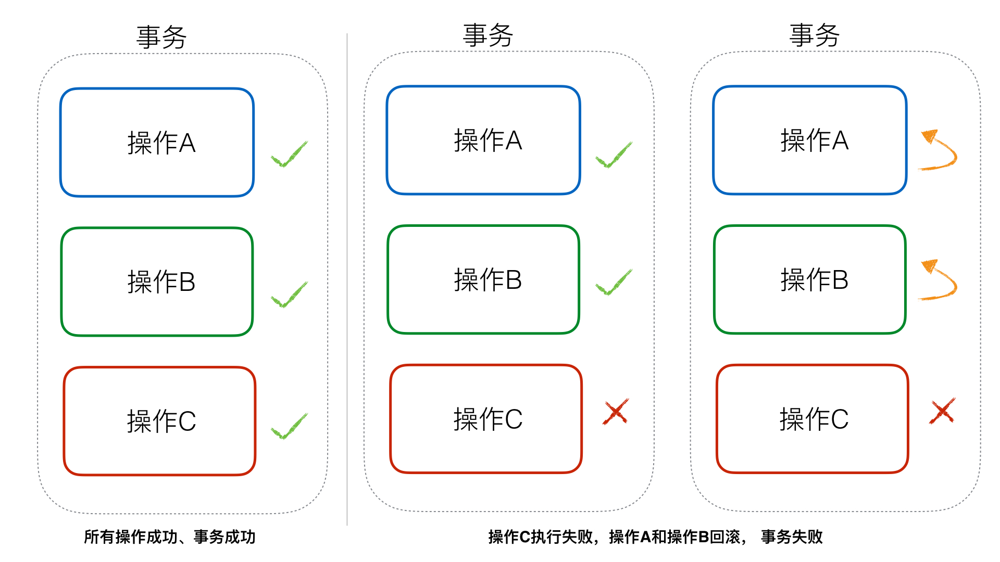

### 二、ACID理论

​		事务是基于数据进行操作，需要保证事务的数据通常存储在数据库中，所以介绍到事务，就不得不介绍数据库事务的`ACID`特性，指数据库事务正确执行的四个基本特性的缩写。包含：

* **原子性（Atomicity）**

* **一致性（Consistency）**

* **隔离性（Isolation）**

* **持久性（Durability）**

#### (1) **原子性（Atomicity）** 

​		整个事务中的所有操作，要么全部完成，要么全部不完成，不可能停滞在中间某个环节。

 例如：银行转账，从A账户转100元至B账户：

   A、从A账户取100元

   B、存入100元至B账户。 这两步要么一起完成，要么一起不完成，如果只完成第一步，第二步失败，钱会莫名其妙少了100元。

#### (2) **一致性（Consistency）**

 在事务开始之前和事务结束以后，数据库数据的一致性约束没有被破坏。

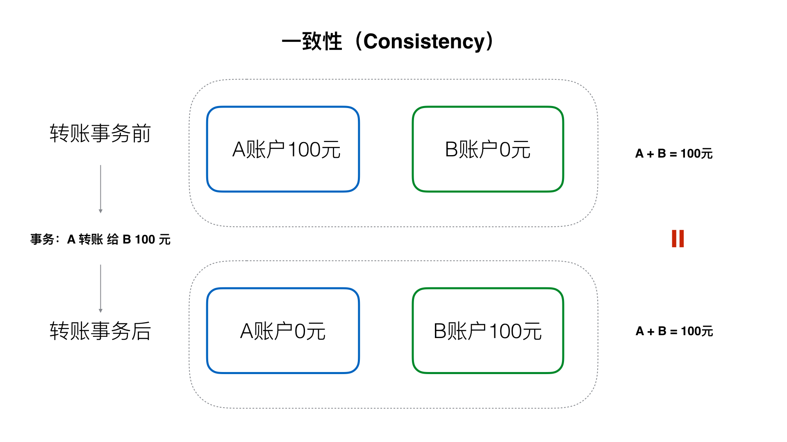

 例如：现有完整性约束A+B=100，如果一个事务改变了A，那么必须得改变B，使得事务结束后依然满足A+B=100，否则事务失败。

#### (3) **隔离性（Isolation）**

​		数据库允许多个并发事务同时对数据进行读写和修改的能力，如果一个事务要访问的数据正在被另外一个事务修改，只要另外一个事务未提交，它所访问的数据就不受未提交事务的影响。隔离性可以防止多个事务并发执行时由于交叉执行而导致数据的不一致。 

例如：现有有个交易是从A账户转100元至B账户，在这个交易事务还未完成的情况下，如果此时B查询自己的账户，是看不到新增加的100元的。

#### (4) **持久性（Durability）**

​		事务处理结束后，对数据的修改就是永久的，即便系统故障也不会丢失。

​		本地事务ACID实际上可用”统一提交，失败回滚“几个字总结，严格保证了同一事务内数据的一致性！

而分布式事务不能实现这种`ACID`。因为有CAP理论约束。接下来我们来了解一下，分布式中是如何保证以上特性的，那么就有了一个著名的CAP理论。

---

### 三、CAP理论

​		在设计一个大规模可扩放的网络服务时候会遇到三个特性：一致性（consistency）、可用性（Availability）、分区容错（partition-tolerance）都需要的情景.

​		CAP定律说的是在一个分布式计算机系统中，一致性，可用性和分区容错性这三种保证无法同时得到满足，最多满足两个。

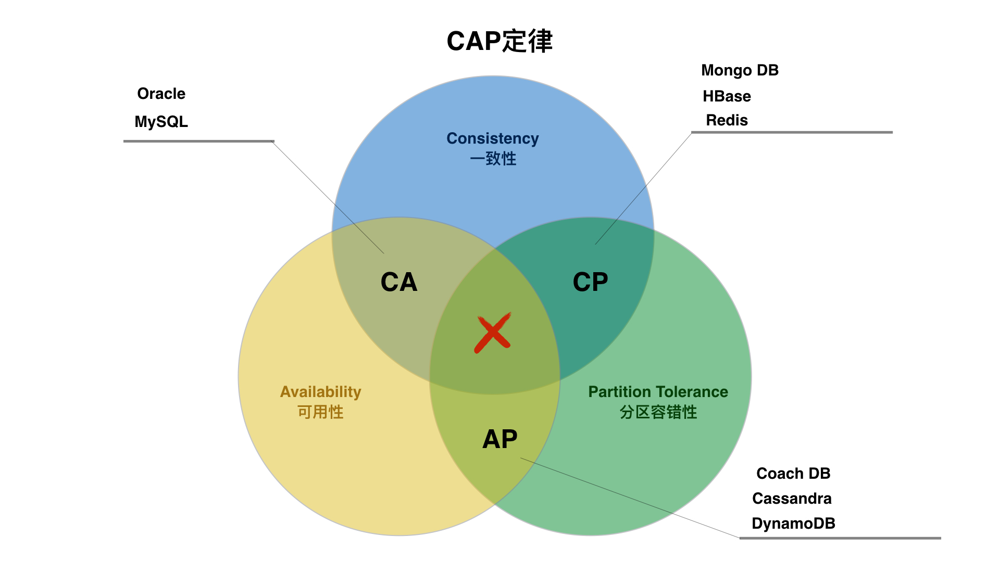

​	如上图，CAP的三种特性只能同时满足两个。而且在不同的两两组合，也有一些成熟的分布式产品。

接下来，我们来介绍一下CAP的三种特性，我们采用一个应用场景来分析CAP中的每个特点的含义。

该场景整体分为5个流程：

流程一、客户端发送请求(如:添加订单、修改订单、删除订单)

流程二、Web业务层处理业务，并修改存储成数据信息

流程三、存储层内部Master与Backup的数据同步

流程四、Web业务层从存储层取出数据

流程五、Web业务层返回数据给客户端

#### (1) 一致性Consistency

> “`all nodes see the same data at the same time`”

一旦数据更新完成并成功返回客户端后，那么分布式系统中所有节点在同一时间的数据完全一致。

>  在CAP的一致性中还包括强一致性、弱一致性、最终一致性等级别，稍后我们在后续章节介绍。

一致性是指写操作后的读操作可以读取到最新的数据状态，当数据分布在多个节点上，从任意结点读取到的数据都是最新的状态。

##### 一致性实现目标：

* Web业务层向主Master写数据库成功，从Backup读数据也成功。

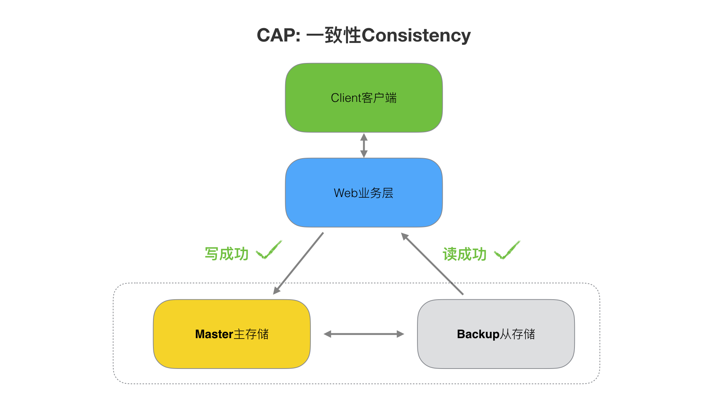

* Web业务层向主Master读数据库失败，从Backup读数据也失败。

##### 必要实现流程：

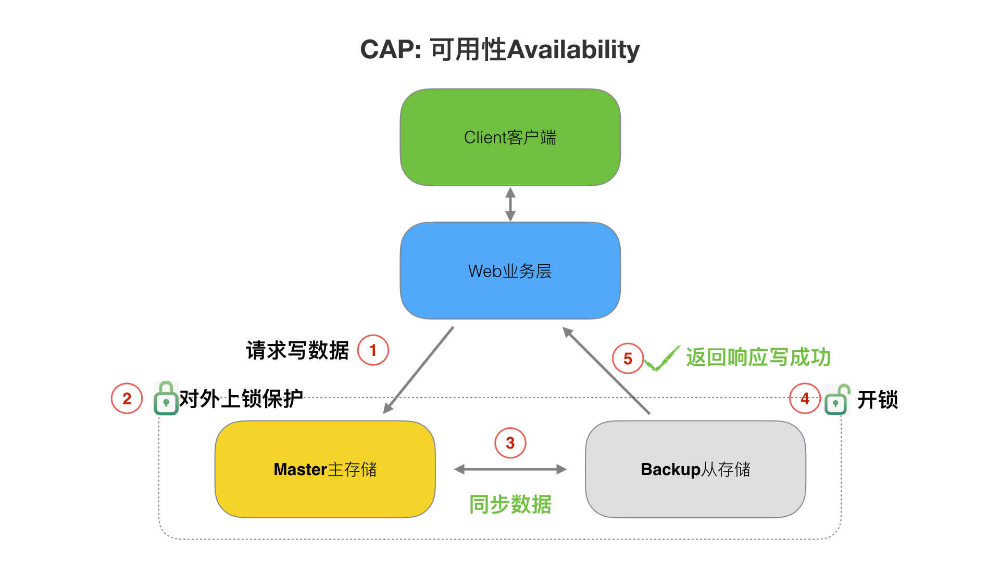

写入主数据库后，在向从数据库同步期间要将从数据库锁定，待同步完成后再释放锁，以免在新数据写入成功后，向从数据库查询到旧的数据。

##### 分布式一致性特点：

1. 由于存在数据同步的过程，写操作的响应会有一定的延迟。
2. 为了保证数据一致性会对资源暂时锁定，待数据同步完成释放锁定资源。
3. 如果请求数据同步失败的结点则会返回错误信息，一定不会返回旧数据。

#### (2) 可用性(Availability)

> “`Reads and writes always succeed`”

服务一直可用，而且是正常响应时间。

对于可用性的衡量标准如下：

| 可用性分类                   | 可用水平（%） | 一年中可容忍停机时间 |
| :--------------------------- | :------------ | :------------------- |
| 容错可用性                   | 99.9999       | <1 min               |
| 极高可用性                   | 99.999        | <5 min               |
| 具有故障自动恢复能力的可用性 | 99.99         | <53 min              |
| 高可用性                     | 99.9          | <8.8h                |
| 商品可用性                   | 99            | <43.8 min            |

##### 可用性实现目标：

* 当Master正在被更新，Backup数据库接收到数据查询的请求则立即能够响应数据查询结果。

* backup数据库不允许出现响应超时或响应错误。

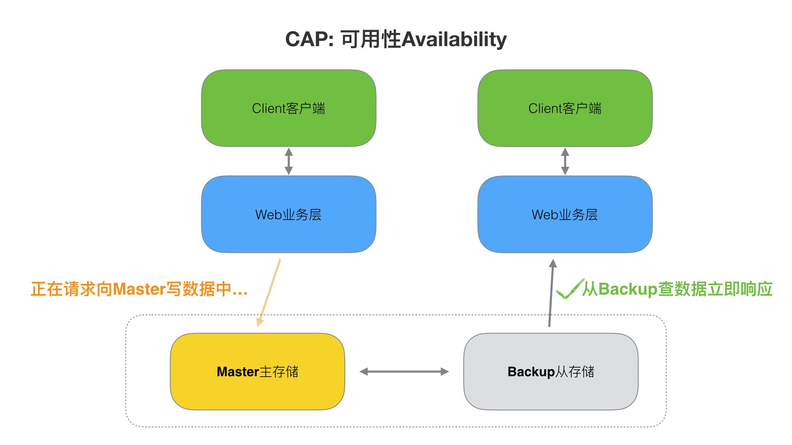

##### 必要实现流程：

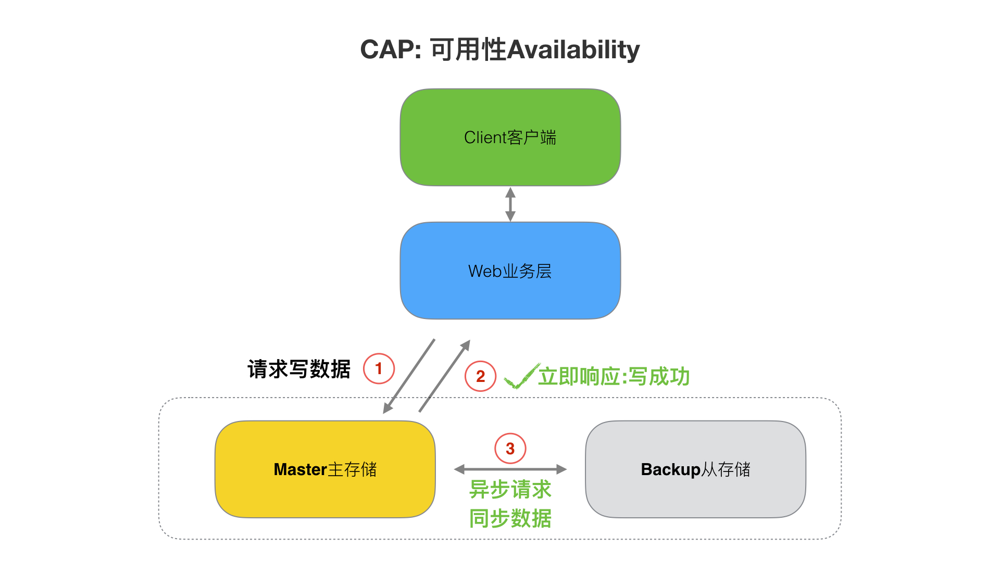

1. 写入Master主数据库后要将数据同步到从数据库。
2. 由于要保证Backup从数据库的可用性，不可将Backup从数据库中的资源进行锁定。
3. 即时数据还没有同步过来，从数据库也要返回要查询的数据，哪怕是旧数据/或者默认数据，但不能返回错误或响应超时。

##### 分布式可用性特点：

所有请求都有响应，且不会出现响应超时或响应错误。

#### (3) 分区容错性(Partition tolerance)

> “`the system continues to operate despite arbitrary message loss or failure of part of the system`”

分布式系统中，尽管部分节点出现任何消息丢失或者故障，系统应继续运行。

通常分布式系统的各各结点部署在不同的子网，这就是网络分区，不可避免的会出现由于网络问题而导致结点之间通信失败，此时仍可对外提供服务。

##### 分区容错性实现目标：

* 主数据库向从数据库同步数据失败不影响读写操作。

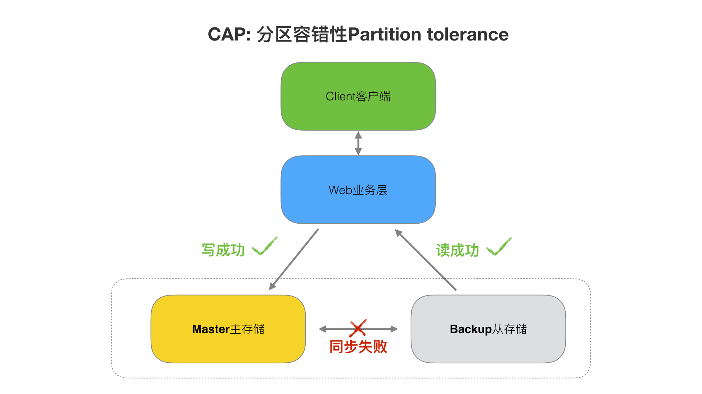

* 其一个结点挂掉不影响另一个结点对外提供服务。

##### 必要实现流程：

1. 尽量使用异步取代同步操作，例如使用异步方式将数据从主数据库同步到从数据，这样结点之间能有效的实现松耦合。
2. 添加Backup从数据库结点，其中一个Backup从结点挂掉其它Backup从结点提供服务。

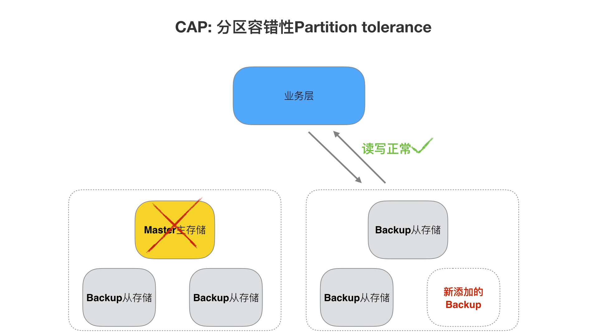

##### 分区容错性特点：

分区容忍性分是布式系统具备的基本能力。

### 四、CAP的”3选2“证明

#### (1) 基本场景

在小结中，我们主要介绍CAP的理论为什么不能够3个特性同时满足。

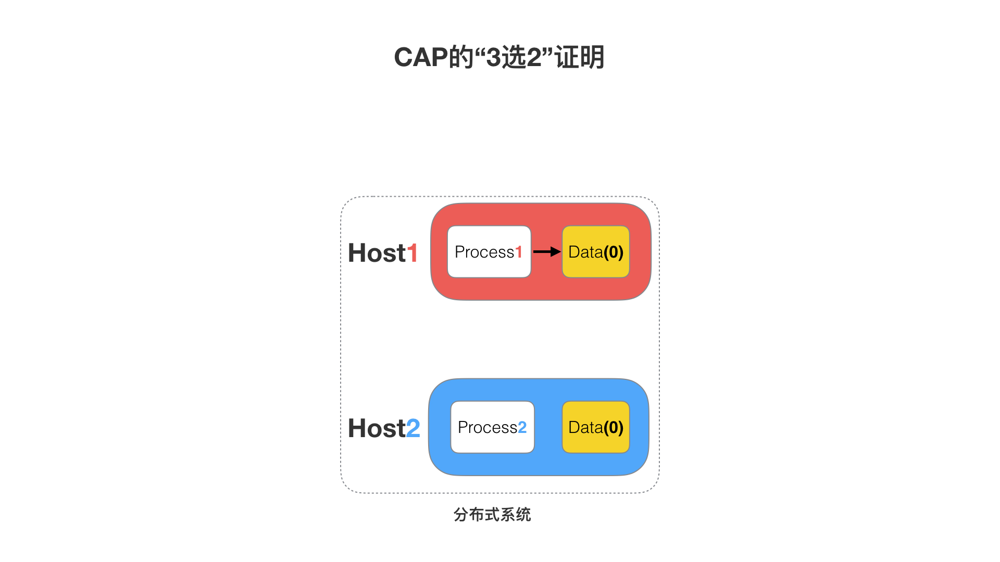

如上图，是我们证明CAP的基本场景，分布式网络中有两个节点Host1和Host2，他们之间网络可以连通，Host1中运行Process1程序和对应的数据库Data，Host2中运行Process2程序和对应数据库Data。

#### (2) CAP特性

`如果满足一致性(C)`：那么`Data(0) = Data(0)`.

`如果满足可用性(A)`:  用户不管请求Host1或Host2，都会立刻响应结果。

`如果满足分区容错性(P)`: Host1或Host2有一方脱离系统(故障)， 都不会影响Host1和Host2彼此之间正常运作。

#### (3) 分布式系统正常运行流程

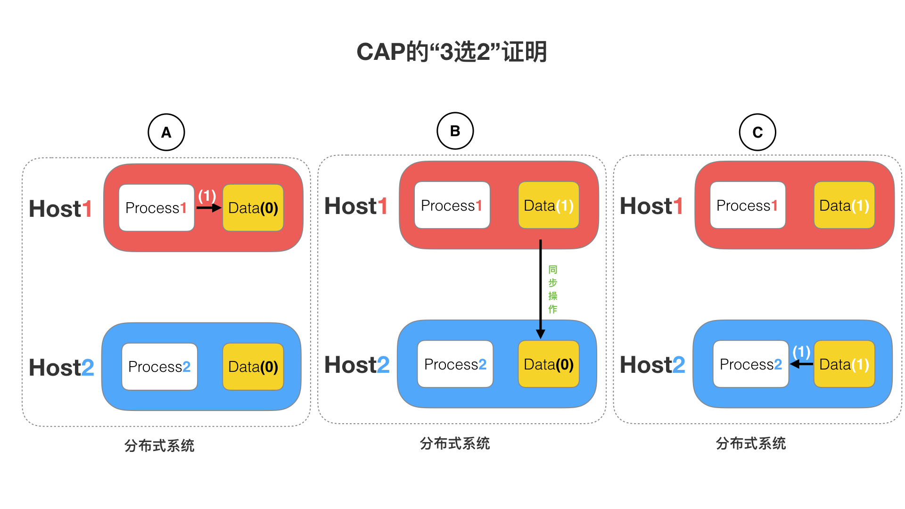

如上图，是分布式系统正常运转的流程。

A、用户向`Host1`主机请求数据更新，程序`Process1`更新数据库`Data(0)`为`Data(1)`

B、分布式系统将数据进行同步操作，将`Host1`中的`Data(1)`同步的`Host2`中``Data(0)`,使`Host2`中的数据也变为`Data(1)`

C、当用户请求主机`Host2`时，则`Process2`则响应最新的`Data(1)`数据

根据CAP的特性：

* `Host1`和`Host2`的数据库`Data`之间的数据是否一样为一致性(C)

* 用户对`Host1`和`Host2`的请求响应为可用性(A)

* `Host1`和`Host2`之间的各自网络环境为分区容错性(P)

当前是一个正常运作的流程，目前CAP三个特性可以同时满足，也是一个`理想状态`,但是实际应用场景中，发生错误在所难免，那么如果发生错误CAP是否能同时满足，或者该如何取舍？

---

#### (4) 分布式系统异常运行流程

假设`Host1`和`Host2`之间的网络断开了，我们要支持这种网络异常，相当于要满足`分区容错性(P)`，能不能同时满足`一致性(C)`和`可用响应性(A)`呢？

假设在N1和N2之间网络断开的时候，

A、用户向`Host1`发送数据更新请求，那`Host1`中的数据`Data(0)`将被更新为`Data(1)`

B、弱此时`Host1`和`Host2`网络是断开的，所以分布式系统同步操作将失败，`Host2`中的数据依旧是`Data(0)`

C、有用户向`Host2`发送数据读取请求，由于数据还没有进行同步，`Process2`没办法立即给用户返回最新的数据V1，那么将面临两个选择。

第一，牺牲`数据一致性(c)`，响应旧的数据`Data(0)`给用户；

第二，牺牲`可用性(A)`，阻塞等待，直到网络连接恢复，数据同步完成之后，再给用户响应最新的数据`Data(1)`。

这个过程，证明了要满足`分区容错性(p)`的分布式系统，只能在`一致性(C)`和`可用性(A)`两者中，选择其中一个。

#### (5) "3选2"的必然性

通过CAP理论，我们知道无法同时满足`一致性`、`可用性`和`分区容错性`这三个特性，那要舍弃哪个呢？

##### CA 放弃 P：

一个分布式系统中，不可能存在不满足P，放弃`分区容错性(p)`，即不进行分区，不考虑由于网络不通或结点挂掉的问题，则可以实现一致性和可用性。那么系统将不是一个标准的分布式系统。我们最常用的关系型数据就满足了CA，如下：

主数据库和从数据库中间不再进行数据同步，数据库可以响应每次的查询请求，通过事务(原子性操作)隔离级别实现每个查询请求都可以返回最新的数据。

注意：

> 对于一个分布式系统来说。P是一个基本要求，CAP三者中，只能在CA两者之间做权衡，并且要想尽办法提升P。

#####  CP 放弃 A

如果一个分布式系统不要求强的可用性，即容许系统停机或者长时间无响应的话，就可以在CAP三者中保障CP而舍弃A。

放弃可用性，追求一致性和分区容错性，如Redis、HBase等，还有分布式系统中常用的Zookeeper也是在CAP三者之中选择优先保证CP的。

<u>场景：</u>

跨行转账，一次转账请求要等待双方银行系统都完成整个事务才算完成。

##### AP 放弃 C

放弃一致性，追求分区容忍性和可用性。这是很多分布式系统设计时的选择。实现AP，前提是只要用户可以接受所查询的到数据在一定时间内不是最新的即可。

通常实现AP都会保证最终一致性，后面讲的BASE理论就是根据AP来扩展的。

<u>场景1：</u>

 淘宝订单退款。今日退款成功，明日账户到账，只要用户可以接受在一定时间内到账即可。

<u>场景2：</u>

12306的买票。都是在可用性和一致性之间舍弃了一致性而选择可用性。

你在12306买票的时候肯定遇到过这种场景，当你购买的时候提示你是有票的（但是可能实际已经没票了），你也正常的去输入验证码，下单了。但是过了一会系统提示你下单失败，余票不足。这其实就是先在可用性方面保证系统可以正常的服务，然后在数据的一致性方面做了些牺牲，会影响一些用户体验，但是也不至于造成用户流程的严重阻塞。

但是，我们说很多网站牺牲了一致性，选择了可用性，这其实也不准确的。就比如上面的买票的例子，其实舍弃的只是强一致性。退而求其次保证了最终一致性。也就是说，虽然下单的瞬间，关于车票的库存可能存在数据不一致的情况，但是过了一段时间，还是要保证最终一致性的。

#### (6) 总结:

>  CA 放弃 P：如果不要求P（不允许分区），则C（强一致性）和A（可用性）是可以保证的。这样分区将永远不会存在，因此CA的系统更多的是允许分区后各子系统依然保持CA。

>  CP 放弃 A：如果不要求A（可用），相当于每个请求都需要在Server之间强一致，而P（分区）会导致同步时间无限延长，如此CP也是可以保证的。很多传统的数据库分布式事务都属于这种模式。

>  AP 放弃 C：要高可用并允许分区，则需放弃一致性。一旦分区发生，节点之间可能会失去联系，为了高可用，每个节点只能用本地数据提供服务，而这样会导致全局数据的不一致性。现在众多的NoSQL都属于此类。

### 五、思考

#### 思考：按照CAP理论如何设计一个电商系统？

- 首先个电商网站核心模块有**用户，订单，商品，支付，促销管理**等

> 1、对于用户模块，包括登录，个人设置，个人订单，购物车，收藏夹等，这些模块保证AP，数据短时间不一致不影响使用。
>  2、订单模块的下单付款扣减库存操作是整个系统的核心，CA都需要保证，极端情况下面牺牲A保证C
>  3、商品模块的商品上下架和库存管理保证CP
>  4、搜索功能因为本身就不是实时性非常高的模块，所以保证AP就可以了。
>  5、促销是短时间的数据不一致，结果就是优惠信息看不到，但是已有的优惠要保证可用，而且优惠可以提前预计算，所以可以保证AP。
>  6、支付这一块是独立的系统，或者使用第三方的支付宝，微信。其实CAP是由第三方来保证的，支付系统是一个对CAP要求极高的系统，C是必须要保证的，AP中A相对更重要，不能因为分区，导致所有人都不能支付

### 六、分布式BASE理论

​		CAP 不可能同时满足，而`分区容错性(P)`是对于分布式系统而言是必须的。如果系统能够同时实现 CAP 是再好不过的了，所以出现了 BASE 理论。

#### (1) BASE理论

> 通用定义

BASE是**Basically Available(基本可用）**、**Soft state(软状态）**和**Eventually consistent(最终一致性）**三个短语的简写。

BASE是对CAP中一致性和可用性权衡的结果，其来源于对大规模互联网系统分布式实践的总结，是**基于CAP定理逐步演化**而来的，其核心思想是即使无法做到强一致性，但每个应用都可以根据自身的业务特点，采用适当的方法来使系统达到**最终一致性**。

> 两个对冲理念：ACID和BASE

`ACID`是传统数据库常用的设计理念，`追求强一致性`模型。

`BASE`支持的是大型分布式系统，提出通过`牺牲强一致性`获得`高可用性`。

#### (2) Basically Available(基本可用)

实际上就是两个妥协。

* 对响应上时间的妥协：正常情况下，一个在线搜索引擎需要在0.5秒之内返回给用户相应的查询结果，但由于出现故障（比如系统部分机房发生断电或断网故障），查询结果的响应时间增加到了1~2秒。

* 对功能损失的妥协：正常情况下，在一个电子商务网站（比如淘宝）上购物，消费者几乎能够顺利地完成每一笔订单。但在一些节日大促购物高峰的时候（比如双十一、双十二），由于消费者的购物行为激增，为了保护系统的稳定性（或者保证一致性），部分消费者可能会被引导到一个降级页面，如下：

#### (3) Soft state（软状态）

- 原子性（硬状态） -> 要求多个节点的数据副本都是一致的,这是一种"硬状态"

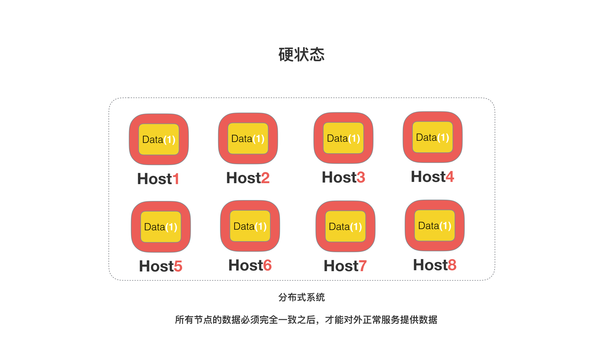

- 软状态（弱状态） -> 允许系统中的数据存在中间状态,并认为该状态不影响系统的整体可用性,即允许系统在多个不同节点的数据副本存在数据延迟。
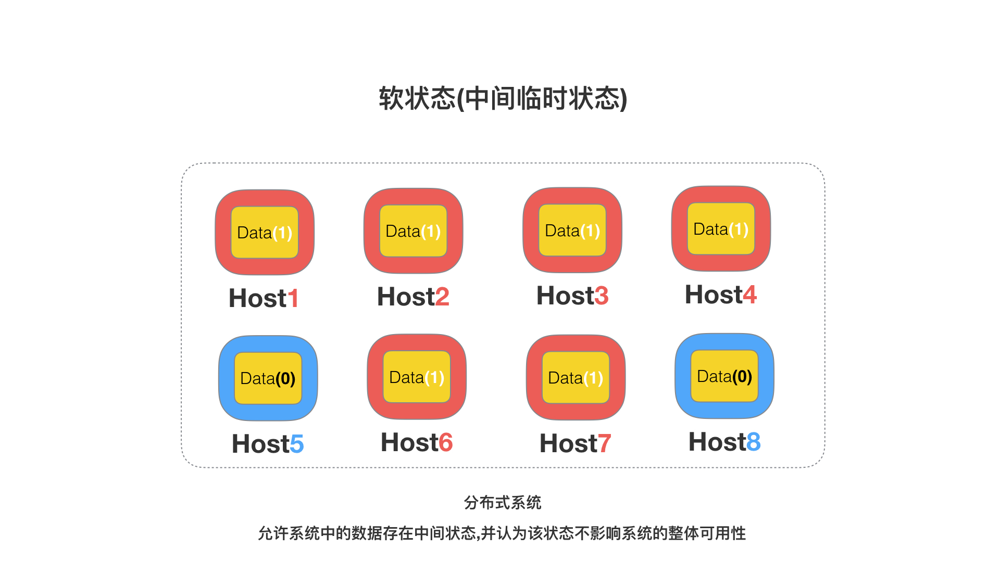

#### (4) Eventually consistent（最终一致性）

上面说软状态，然后不可能一直是软状态，必须有个时间期限。在期限过后，应当保证所有副本保持数据一致性。从而达到数据的最终一致性。这个时间期限取决于网络延时，系统负载，数据复制方案设计等等因素。

稍微官方一点的说法就是：

> 系统能够保证在没有其他新的更新操作的情况下，数据最终一定能够达到一致的状态，因此所有客户端对系统的数据访问最终都能够获取到最新的值。

#### (5) BASE总结

总的来说，BASE 理论面向的是大型高可用可扩展的分布式系统，和传统事务的 ACID 是**相反的**，它完全不同于 ACID 的强一致性模型，而是**通过牺牲强一致性**来获得可用性，并允许数据在一段时间是不一致的。

参考：

https://blog.csdn.net/weixin_44062339/article/details/99710968

https://blog.csdn.net/w372426096/article/details/80437198

https://www.solves.com.cn/it/cxkf/bk/2019-09-24/5229.html

https://www.jianshu.com/p/46b90dfc7c90

https://www.jianshu.com/p/9cb2a6fa4e0e

https://www.jianshu.com/p/68c7c16b3fbd

